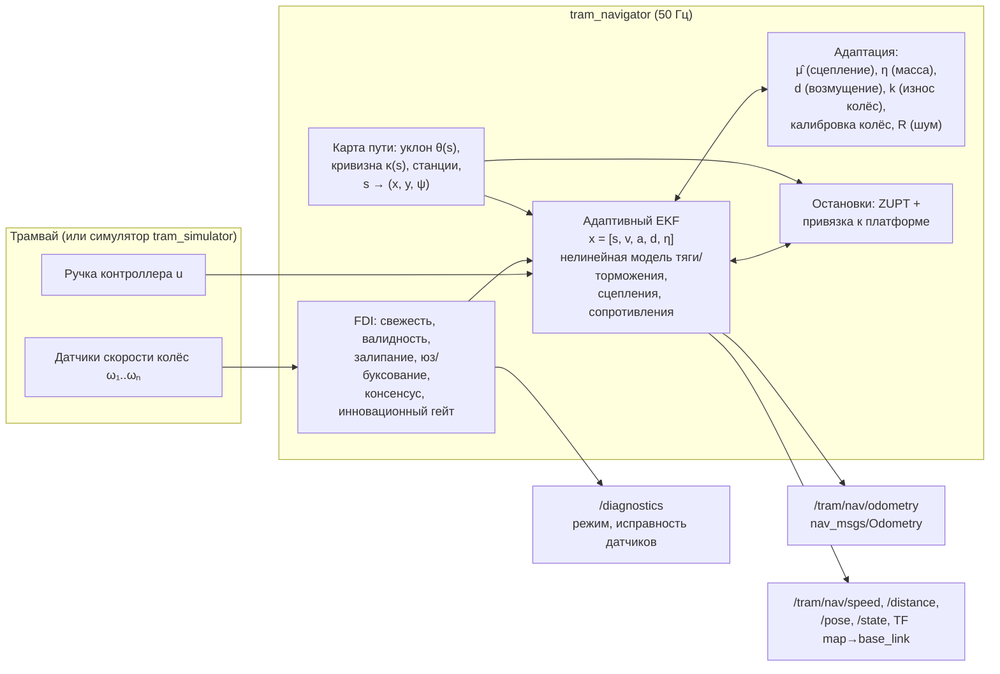
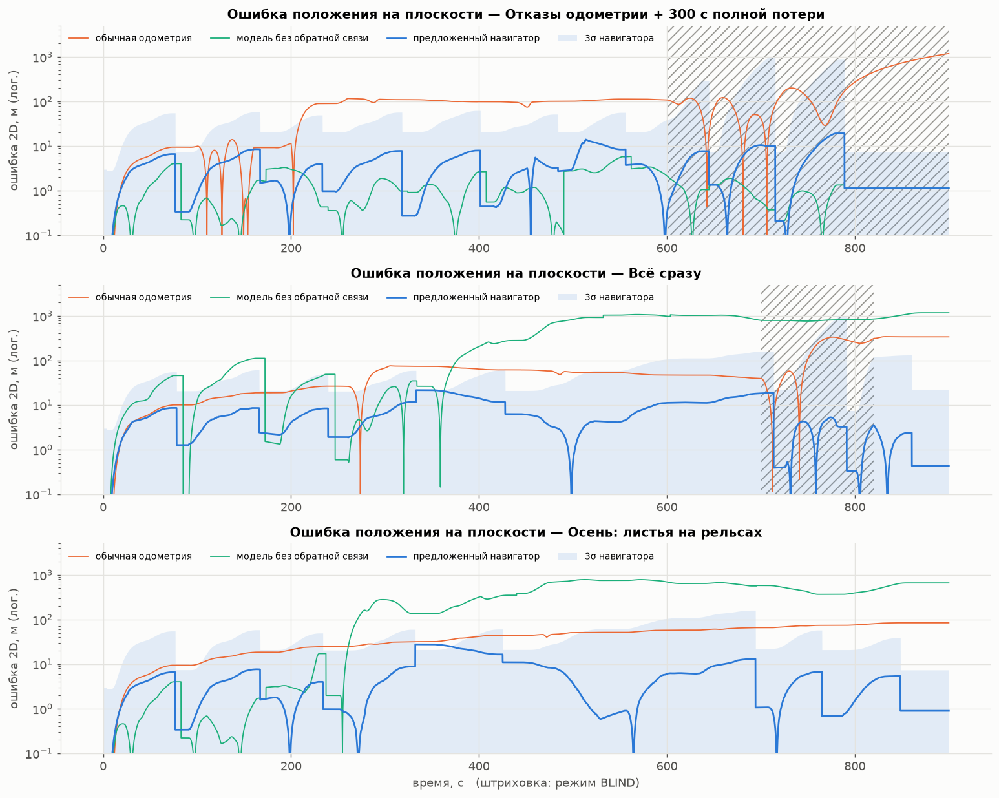
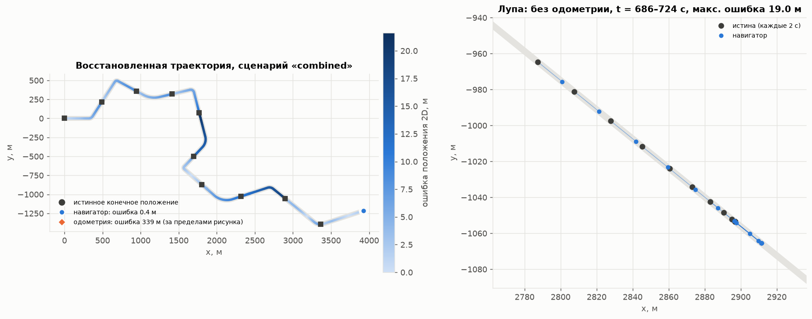

# Бесспутниковая навигация беспилотного трамвая по модели движения

**Резервное вычисление скорости и положения трамвая без GNSS и инерциальных систем** — только по положению
ручки контроллера водителя и одометрии (скорости вращения колёсных пар). Адаптивная нелинейная модель
движения трамвая объединена с одометрией в расширенном фильтре Калмана с идентификацией параметров
объекта, оценкой возмущений, обнаружением проскальзывания/юза и отказов датчиков. Решение оформлено как
пакет **ROS 2 Humble** (Python, `ament_python`) и публикует непрерывный поток координат и скорости.

<p align="center">
  
</p>

| | Предложенный навигатор | Обычная одометрия | Модель без обратной связи |
|---|---|---|---|
| Ошибка положения, медиана по 24 случайным прогонам (Монте-Карло) | **0.38 % пути** | 1.57 % | 15.5 % |
| Ошибка положения, худший прогон Монте-Карло | **1.72 %** | 14.2 % | 79.9 % |
| СКО скорости, медиана Монте-Карло | **0.12 м/с** | 0.14 м/с | 3.3 м/с |
| Отказы датчиков + 300 с полной потери одометрии (`sensor_faults`) | **24 м** | 1190 м | 6 м\* |
| Демо-rosbag через ROS 2 в реальном времени, эталон GNSS (7 мин, 100 с без одометрии) | **СКО 12 м** | — | — |
| Время шага / задержка вход→выход / частота / CPU / память (ROS 2) | **0,3 мс / 0,9 мс / 50 Гц / 13–15 % ядра / 72 МБ** | — | — |

\* «Модель без обратной связи» хороша только тогда, когда реальный трамвай совпадает с номинальным
(сухие рельсы, номинальная масса). При смене погоды или параметров её ошибка достигает километров
(см. таблицу результатов).


## Материалы для жюри

| # | Что | Ссылка |
|---|---|---|
| 1 | Пакет ROS 2 Humble (Python, `ament_python`, `colcon build`): подписка на ручку и одометрию, публикация **`/result/velocity`** и **`/result/position`** | [`tram_nav/`](https://github.com/ilushenssss/odometer-on-model/tree/main/tram_nav) — нода [`navigator_node.py`](https://github.com/ilushenssss/odometer-on-model/blob/main/tram_nav/tram_nav/nodes/navigator_node.py), [`package.xml`](https://github.com/ilushenssss/odometer-on-model/blob/main/tram_nav/package.xml), [`setup.py`](https://github.com/ilushenssss/odometer-on-model/blob/main/tram_nav/setup.py), launch: [`bag_replay.launch.py`](https://github.com/ilushenssss/odometer-on-model/blob/main/tram_nav/launch/bag_replay.launch.py) |
| 2 | Инструкция для жюри: воспроизведение rosbag, ожидаемые топики, логи, метрики, задержка | [`docs/JURY_GUIDE.md`](https://github.com/ilushenssss/odometer-on-model/blob/main/docs/JURY_GUIDE.md) + готовый bag [`data/demo_bag/`](https://github.com/ilushenssss/odometer-on-model/tree/main/data/demo_bag) |
| 3 | Математическая модель: уравнения, структура, входы/выходы, оценка ускорения, переход «момент → скорость» | [`docs/MODEL.md`](https://github.com/ilushenssss/odometer-on-model/blob/main/docs/MODEL.md) |
| 4 | Допущения, ограничения, конфигурируемые параметры (начальная позиция, масса, радиус колеса, сопротивление, пороги проскальзывания, параметры фильтра) | [`docs/PARAMETERS.md`](https://github.com/ilushenssss/odometer-on-model/blob/main/docs/PARAMETERS.md) |
| 5 | Точность и быстродействие: методика сравнения с GNSS-эталоном, таблицы ошибок, графики, задержка, частота, ресурсы | [`docs/ACCURACY.md`](https://github.com/ilushenssss/odometer-on-model/blob/main/docs/ACCURACY.md) |
| 6 | Ограничения решения и план развития после хакатона | [`docs/LIMITATIONS.md`](https://github.com/ilushenssss/odometer-on-model/blob/main/docs/LIMITATIONS.md) |

---

## Содержание

1. [Постановка задачи](#1-постановка-задачи)
2. [Архитектура решения](#2-архитектура-решения)
3. [Математическая модель трамвая](#3-математическая-модель-трамвая)
4. [Адаптивный оцениватель (EKF)](#4-адаптивный-оцениватель-ekf)
5. [Проскальзывание, юз и отказы датчиков (FDI)](#5-проскальзывание-юз-и-отказы-датчиков-fdi)
6. [Бесспутниковая навигация: от расстояния к координатам](#6-бесспутниковая-навигация-от-расстояния-к-координатам)
7. [Пакет ROS 2](#7-пакет-ros-2)
8. [Испытательный стенд (симулятор)](#8-испытательный-стенд-симулятор)
9. [Результаты](#9-результаты)
10. [Построение траектории и её тесты](#10-построение-траектории-и-её-тесты)
11. [Быстродействие](#11-быстродействие)
12. [Тесты](#12-тесты)
13. [Структура репозитория](#13-структура-репозитория)
14. [Ограничения и развитие](#14-ограничения-и-развитие)

---

## 1. Постановка задачи

Беспилотный трамвай должен знать своё положение и скорость и тогда, когда пропадает сигнал спутников
(«городские каньоны», тоннели, эстакады) и отказывают другие навигационные системы. В резервном режиме
доступны только внутренние данные:

* **положение ручки контроллера** `u ∈ [-1, 1]` (тяга `u > 0`, выбег, торможение `u < 0`, экстренное
  торможение `u ≤ -0.95`);
* **одометрия**: угловые скорости нескольких колёсных пар (в примере 3 датчика: две моторные оси и одна
  немоторная).

Трудности:

* **проскальзывание и юз** в плохую погоду (мокрые рельсы, листья, лёд). Колесо вращается быстрее
  (тяга) или медленнее (торможение) реальной скорости, иногда буксует на месте;
* **отказы датчиков**: обрыв (нет сообщений), залипание, ноль, выбросы, дрейф масштаба, шум;
* **меняющиеся параметры объекта**: масса с пассажирами, износ бандажей, отказ тягового преобразователя,
  сопротивление движению;
* **стохастичность** возмущений и параметров;
* **жёсткие требования к быстродействию**.

## 2. Архитектура решения



Идея — **«одометр на модели»**. Нелинейная модель предсказывает, как трамвай должен ускоряться при
данном положении ручки, уклоне и сцеплении. Одометрия используется только там, где она физически
правдоподобна и согласована с моделью и другими датчиками. Если одометрии нет совсем, трамвай «ведёт»
сама модель с параметрами, идентифицированными, пока датчики работали.

## 3. Математическая модель трамвая

Параметры по умолчанию соответствуют 100 %-низкопольному трёхсекционному трамваю (класс 71-931М):
номинальная масса 50 т (42 т тара, до 62 т с пассажирами), 4 оси, из них 3 моторные, радиус колеса 0.33 м.

### 3.1 Продольная динамика

$$
(1+\gamma)\,m\,\dot v = F_w(u, v) + F_{tb}(u, v) - F_{res}(v) - m g \sin\theta(s) - m\,k_c\,|\kappa(s)|
$$

| Составляющая | Модель | Нелинейность |
|---|---|---|
| Тяговое усилие | $F_w = \bar u \cdot \min(F_0,\ P/v)$, $F_0 = 70$ кН, $P = 560$ кВт | гиперболическая тяговая характеристика, мёртвая зона ручки |
| Служебное торможение | $F_w = -\bar u_b F_{b,max}\,\mathrm{sgn}(v)$, доля ЭДТ $\sigma(v)$ | смешивание электродинамического и фрикционного тормозов, угасание ЭДТ ниже 1.5 м/с |
| Экстренное торможение | + магниторельсовый тормоз $F_{tb} = -60$ кН | не зависит от сцепления |
| Сопротивление | $F_{res} = m(c_0\,\mathrm{sgn}\,v + c_1 v) + c_2 v\lvert v\rvert$ | сглаженное трение покоя, аэродинамика |
| Уклон и кривые | $g\sin\theta(s)$, $k_c/R(s)$ из карты | зависят от положения |
| Привод | $\dot a = (a_{cmd}(u(t-\tau_d), v) - a)/\tau$, $\tau_d = 0.1$ с | транспортная задержка и инерционность преобразователя |
| Удержание на месте | при $v \approx 0$ и $u \le 0$: $\dot v = 0$ | гибридная модель, трамвай не катится назад под тормозом |

<p align="center"></p>

### 3.2 Сцепление колеса с рельсом (кривая крипа)

Сила сцепления оси зависит от относительного проскальзывания $\lambda = (v_w - v)/v$:

$$
\mu(\lambda) = \begin{cases}
\mu_{pk}\,\dfrac{|\lambda|}{\lambda_p}\left(2-\dfrac{|\lambda|}{\lambda_p}\right), & |\lambda| \le \lambda_p \\[2mm]
\mu_{pk}\left(r_s + (1-r_s)\,e^{-\beta(|\lambda|-\lambda_p)}\right), & |\lambda| > \lambda_p
\end{cases}
\qquad \mu_{pk} = \frac{\mu_{max}\,\xi(s)}{1 + c_v |v|}
$$

После пика ($\lambda_p \approx 2\,\%$) ветвь падающая. Как только требуемая сила превышает
$\mu_{pk} N$, движение колеса неустойчиво, и начинается буксование (тяга) или юз (торможение).
$\xi(s)$ — пространственно-коррелированная случайная неоднородность рельса. $\mu_{max}$ задаёт погода:
сухо 0.30, мокро 0.18, листья 0.11, лёд 0.09.

### 3.3 Модель, которую использует навигатор

Навигатор не знает истинных массы, сцепления, износа колёс, КПД тяги и сопротивления. Он использует ту
же структуру модели с **номинальными** параметрами, а расхождение компенсирует адаптивными
состояниями:

$$
\dot v = \underbrace{\mathrm{sat}_{\hat\mu}\!\big(\eta\,a\big)}_{\text{тяга/торможение через колёса}} + \eta\,a_{tb}
- \frac{c_0\,\mathrm{sgn}\,v + c_1 v + \eta\,c_2 v|v|/m_0 + g\sin\theta(s) + k_c|\kappa(s)|}{1+\gamma} + d
$$

* $\eta = m_0/m$ — обратная относительная масса. Идентифицируется онлайн; неопределённость увеличивается
  на каждой остановке, где входят и выходят пассажиры;
* $d$ — немоделируемое удельное усилие (процесс Гаусса–Маркова);
* $\mathrm{sat}_{\hat\mu}$ — **гладкое ограничение по сцеплению**
  $x/(1+|x/L|^6)^{1/6}$, где $L = \hat\mu g\,n_{мот}/n_{осей}/(1+\gamma)$ в тяге (при торможении
  учитывается распределение ЭДТ по моторным осям). Коэффициент $\hat\mu$ оценивается адаптивно
  (раздел 4.3);
* $a$ — состояние привода (запаздывающее заданное удельное усилие).

## 4. Адаптивный оцениватель (EKF)

### 4.1 Вектор состояния и прогноз

$$
x = [\,s,\ v,\ a,\ d,\ \eta\,]^T
$$

Прогноз интегрирует нелинейную модель (Эйлер, 50 Гц) с **аналитическим якобианом**:
$F = I + J\Delta t$, $P \leftarrow FPF^T + Q\Delta t$. Когда обнаружено проскальзывание, модель менее
надёжна, и $Q_v$, $Q_d$ адаптивно увеличиваются.

> **Почему шум привода мал.** В модели есть произведение $\eta\cdot a$. Если разрешить состоянию $a$
> «гулять» (большой $Q_a$), пара $(\eta, a) \to (c\eta,\ a/c)$ становится ненаблюдаемой, и масса
> уплывает даже на идеальных данных. При $Q_a = 0.02$ оценка $\eta$ несмещённая (≈1.00 при номинальной
> массе; при $Q_a = 0.4$ уплывала до ≈0.87 — проверено на прогоне без износа колёс).

### 4.2 Модель измерений (с учётом крипа)

Для каждого исправного канала одометрии:

$$
z_i = \frac{c_i\,\omega_i\,r_0}{k} = \big(1+\lambda_i(x)\big)\Big(v - \dot v\,\frac{T_w}{2}\Big) + n_i,
\qquad
\lambda_i = \lambda_p\left(1-\sqrt{1-\frac{F_{оси,i}}{\hat\mu N_{оси}}}\right)
$$

* $\lambda_i$ — **ожидаемое микропроскальзывание (крип)** оси. Моторные оси под тягой вращаются быстрее
  кузова на доли процента, у предела сцепления до 2 %. Без этой поправки положение систематически
  убегает вперёд;
* $\dot v\,T_w/2$ — групповая задержка счёта импульсов в окне $T_w = 0.1$ с (компенсируется по модельному ускорению);
* $c_i$ — онлайн-калибровка **относительного** радиуса колёс (по консенсусу каналов, среднее
  нормировано);
* $k$ — **общий** масштаб одометрии (средний износ бандажей), наблюдаем только по абсолютным привязкам
  (раздел 6);
* $n_i$ — шум с **адаптивной дисперсией**: Сейдж–Хаса по принятым инновациям плюс оценка шума канала по
  первым разностям. Коррекция устойчива к выбросам (Хьюбер, $k = 2\sigma$).

### 4.3 Адаптация параметров и идентификация

| Величина | Способ |
|---|---|
| $\eta$ (масса, отношение сила/масса) | состояние EKF, случайное блуждание + рост неопределённости на остановках |
| $d$ (возмущение) | состояние EKF, Гаусс–Марков, $\tau = 60$ с |
| $\hat\mu$ (сцепление) | подтверждённое проскальзывание доказывает, что требуемая сила оси превысила сцепление: $\hat\mu \leftarrow \max(0.7\hat\mu,\ \min(\hat\mu,\ 0.9\,F_{оси}/(mg/n)))$. Подтверждение: началось с аномалии ускорения колеса, длится ≥0.3 с, идёт в физически верную сторону, отклонение < 30 %. Сдвиги радиуса, выбросы и «мёртвые» датчики этим условиям не удовлетворяют. Затем медленное восстановление к априорному значению ($\tau = 120$ с) |
| $k$ (износ колёс) | отношение «пройдено по одометру / расстояние по карте» между двумя привязками к станциям. Шаг обновления ограничен ±1 %, при сильном проскальзывании между станциями обновление пропускается |
| $c_i$ (радиусы колёс) | медленная относительная калибровка при малом ускорении, без проскальзывания, при согласованных каналах |
| $R_i$ (шум каналов) | Сейдж–Хаса + модельно-независимая оценка по разностям |
| (опц.) RBF-аппроксиматор $\hat r(v)$ | нормированная RBF-сеть + РНК с забыванием; обучается на $d$. **По умолчанию выключен**, см. абляцию в разделе 9.4 |

<p align="center"></p>

Слева: масса пассажиров меняется на каждой остановке, и оценка её отслеживает. После отказа тягового
преобразователя (t = 300 с) «тяжелее» и «слабее» по разгону неразличимы. Один параметр η обслуживает и
ослабленную тягу, и нетронутое торможение, поэтому «эффективная масса» ложится между истинной массой и
массой/КПД, а остаток забирает возмущение $d$. Скорость при этом оценивается точно (сценарий
`param_change`: 7 м, 0.06 м/с). В центре: $\hat\mu$ падает
при подтверждённом буксовании на листьях. Справа: сообщаемая неопределённость положения сбрасывается
при каждой привязке к станции.

## 5. Проскальзывание, юз и отказы датчиков (FDI)

Каждый канал одометрии в каждом цикле проходит каскад проверок (`tram_nav/core/fdi.py`):

| № | Проверка | Что ловит | Статус |
|---|---|---|---|
| 1 | Свежесть сообщения (тайм-аут 0.3 с) | обрыв линии, отказ датчика | `DROPOUT` |
| 2 | Конечность и физический диапазон | NaN/inf, мусор | `INVALID` |
| 3 | Бит-в-бит одинаковые **сырые** значения ≥1.5 с при движении | залипание, «ноль» | `STUCK` |
| 4 | Ускорение колеса (база 0.2 с) отличается от модельного более чем на $\max(1.5,\ 5\sigma_i\sqrt2/0.2)$ м/с² | буксование/юз, в т.ч. на месте | `SLIP` |
| 5 | Направленная проверка: в тяге канал быстрее эталона, в торможении медленнее. Эталон — самое медленное колесо в тяге (**предпочтительно немоторная ось**, она не может буксовать) и самое быстрое при торможении | буксование и юз | `SLIP` |
| 6 | Консенсус с медианой непроскальзывающих каналов | дрейф масштаба, неисправность | `SUSPECT` → `FAULT` |
| 7 | Нормированная инновация $e^2/S$ против прогноза модели; порог асимметричный, строже в направлении проскальзывания | всё, что не согласуется с физикой | `SUSPECT` |

Ключевые правила принятия решения:

* проскальзывание — **преходящее** состояние (удержание 1 с). Неисправность — **защёлкивающееся**
  (подтверждение 1.5 с, восстановление после 3 с согласованной работы);
* пока какой-то канал буксует, консенсусная проверка приостанавливается для немоторных осей: при
  буксовании двух моторных колёс «в меньшинстве» оказывается как раз исправный немоторный датчик;
* канал, согласный с большинством (≥3 каналов), принимается даже при провале модельного гейта (с
  увеличенной дисперсией). Прогноз мог быть сбит ещё не изолированным отказом;
* **«вечное» буксование — признак отказа эталона.** Реальное буксование ограничено противобуксовочной
  системой несколькими секундами. Если все моторные каналы согласованно «буксуют» относительно
  немоторного дольше 4 с, неисправен сам немоторный датчик (например, дрейф масштаба). Он
  защёлкивается как `FAULT`, а оценка сцепления, построенная на ложных «буксованиях», сбрасывается;
* **повторный захват**: если все каналы отвергнуты дольше 2 с, согласованные между собой и
  непроскальзывающие каналы принимаются в широком гейте. Фильтр не может навсегда «ослепнуть» из-за
  собственного ухода.

Режимы навигатора: `NOMINAL` (все каналы исправны), `DEGRADED` (часть каналов исключена), `BLIND`
(одометрии нет, счисление по модели), `STANDSTILL` (стоянка). Режим, исправность каждого канала,
калибровки, $\hat\mu$, масса, число привязок и время шага публикуются в `/diagnostics`.

## 6. Бесспутниковая навигация: от расстояния к координатам

Трамвай движется по рельсам, поэтому поза — функция одной координаты $s$ (пройденного пути).
Карта пути (`TrackMap`, CSV `s,x,y,z,station`) даёт:

* $s \rightarrow (x, y, \psi)$ для публикации `nav_msgs/Odometry`. Ковариация положения строится
  вдоль/поперёк пути: $\sigma_\parallel = \sigma_s$, $\sigma_\perp = 5$ см;
* уклон $\theta(s)$ и кривизну $\kappa(s)$ для модели (известные возмущения);
* положения платформ.

**Остановки:**

* **ZUPT** (zero-velocity update): все каналы ≈0, тяги нет. Скорость известна (0), положение
  «заморожено», и остановка не приводит к ползучему дрейфу. Вход/выход из режима с гистерезисом;
* **ZUPT по модели при слепом режиме**: тормоз приложен, модель остановилась. Тормоз не может толкать
  трамвай назад, значит он стоит;
* **Привязка остановки к платформе** (опция `nav.station_snap`, по умолчанию включена). Длительная
  остановка рядом с платформой из карты даёт измерение $s = s_{станции}$ с $\sigma = 2.5$ м (×3 после
  проскальзывания: на скользких рельсах трамвай проезжает платформу). Гейт адаптивный (3σ, 20–60 м).
  Если невязка большая, но правдоподобная, дисперсия раздувается (робастно), а не измерение
  отбрасывается. Между двумя привязками оценивается износ колёс $k$.

> Привязка использует только внутренние данные (одометрия и ручка показывают остановку) и карту пути,
> которая нужна в любом случае для выдачи координат. Она не требует ни GNSS, ни инерциальной системы.
> Остановка на светофоре рядом с платформой может дать неверную привязку; гейт и робастная дисперсия
> ограничивают вред. Без привязок (абляция ниже) ошибка ≈1.2 % пути из-за износа колёс.
> С привязками ≈0.1–0.5 % в обычных условиях.

## 7. Пакет ROS 2

### 7.1 Установка и сборка (ROS 2 Humble)

```bash
mkdir -p ~/ros2_ws/src && cd ~/ros2_ws/src
git clone https://github.com/ilushenssss/odometer-on-model.git
cd ~/ros2_ws
source /opt/ros/humble/setup.bash
rosdep install --from-paths src --ignore-src -y     # numpy, nav_msgs, tf2_ros, ...
colcon build --symlink-install --packages-select tram_nav
source install/setup.bash
```

Пакет проверен на ROS 2 Humble: сборка colcon; полный прогон `sim_demo.launch.py` (900 с сценария
`combined` при ×10 реального времени с `/clock`); воспроизведение rosbag через `bag_replay.launch.py`
в реальном времени с оценкой против GNSS; тесты нод. Использовалась сборка Humble из RoboStack
(conda-forge), т.к. на машине разработки Ubuntu 24.04. Ядро алгоритма (`tram_nav/core`) — чистый
Python + NumPy, от ROS не зависит.

### 7.2 Запуск

```bash
# Проверка на rosbag (для жюри): навигатор + оценка против GNSS + ros2 bag play
cd <репозиторий>/data
ros2 launch tram_nav bag_replay.launch.py bag:=demo_bag track_csv:=demo_track_from_gnss.csv out_dir:=/tmp/tram_eval
ros2 run tram_nav plot_eval --dir /tmp/tram_eval --track demo_track_from_gnss.csv

# Демонстрация с симулятором: симулятор + навигатор + оценка против истины
ros2 launch tram_nav sim_demo.launch.py scenario:=autumn real_time_factor:=5.0

# Только навигатор (реальный трамвай)
ros2 launch tram_nav navigator.launch.py track_csv:=/path/to/line.csv

# Результат
ros2 topic echo /result/velocity
ros2 topic echo /result/position
ros2 topic echo /result/perf        # [step_ms, latency_ms, rate_hz, cpu_pct, rss_mb]
ros2 topic echo /diagnostics
```

Подробная инструкция — [docs/JURY_GUIDE.md](docs/JURY_GUIDE.md). Сценарии симулятора: `nominal`,
`wet`, `autumn`, `ice`, `sensor_faults`, `blackout`, `param_change`, `combined`, `demo`,
`leaves_blackout`. При `real_time_factor ≠ 1` симулятор публикует `/clock`.

Исполняемые файлы пакета: `navigator`, `simulator`, `evaluator`, `make_demo_bag` (rosbag с
GNSS-эталоном из симулятора), `track_from_gnss` (карта линии по GNSS-треку), `plot_eval` (графики
оценки).

### 7.3 Ноды и топики

**`tram_navigator`** (`ros2 run tram_nav navigator`) — основная нода. Имена, типы и единицы входов
задаются параметрами (`handle_topic/type/min/neutral/max`, `wheel_topic/type/units/...`), режим
`timer` (50 Гц) или `event` (на каждое сообщение одометрии).

| Направление | Топик (по умолчанию) | Тип | Содержание |
|---|---|---|---|
| вход | `controller_handle` | `std_msgs/Float64` (или `Float32`, `Int8..Int64`, `UInt8/16`) | положение ручки → `u ∈ [-1, 1]` |
| вход | `wheel_speeds` | `sensor_msgs/JointState` (или `Float64/32MultiArray`, или по топику `Float64/32` на датчик) | скорости колёс [рад/с, об/мин, м/с, км/ч]; `NaN` = нет данных |
| вход | `set_position` | `std_msgs/Float64` | ручная переинициализация $s$ |
| **выход** | **`/result/velocity`** | `geometry_msgs/TwistStamped` (или `Vector3Stamped`, `Float64`) | `twist.linear.x` — скорость [м/с], `angular.z` — скорость рыскания |
| **выход** | **`/result/position`** | `geometry_msgs/PoseStamped` (или `PointStamped`, `PoseWithCovarianceStamped`) | положение (x — восток, y — север) [м] и курс в системе карты |
| выход | `/result/position_geo` | `sensor_msgs/NavSatFix` | широта/долгота (если у карты есть WGS-84) |
| выход, 1 Гц | `/result/perf` | `std_msgs/Float64MultiArray` | `[step_ms, latency_ms, rate_hz, cpu_pct, rss_mb]` |
| выход | `odometry` | `nav_msgs/Odometry` | поза, скорость, ковариации |
| выход | `pose`, `speed`, `distance` | `PoseWithCovarianceStamped`, `Float64` | поза; скорость [м/с]; путь [м] |
| выход | `state` | `std_msgs/Float64MultiArray` | `s, v, a, σs, σv, η, масса, d, μ̂, rbf, k, режим, t_blind, n_used, n_fixes, x, y, ψ` |
| выход, 1 Гц | `/diagnostics` | `diagnostic_msgs/DiagnosticArray` | режим, статус датчиков, калибровки, время шага, задержка, частота, CPU, память |
| выход | TF `map → base_link` | | |

**`tram_simulator`** публикует `controller_handle`, `wheel_speeds`, `ground_truth`
(`nav_msgs/Odometry`, в `pose.position.z` — истинный $s$), `weather`, `/clock`.
**`tram_nav_evaluator`** сравнивает `/result/*` с GNSS (`NavSatFix`) или истиной, публикует
`/eval/errors`, пишет `eval.csv` и `summary.json`.

### 7.4 Параметры

`tram_nav/config/navigator.yaml`: любое поле `TramParams` / `NavigatorParams`
(`tram_nav/core/params.py`) переопределяется с префиксом `tram.` / `nav.`. Основные:

| Параметр | По умолчанию | Смысл |
|---|---|---|
| `rate` | 50 | частота фильтра и публикации, Гц |
| `wheel_joint_names` | `[axle_0, axle_2, axle_3]` | каналы одометрии |
| `sensor_powered` | `[true, true, false]` | моторная ли ось у канала (важно для логики буксования) |
| `tram.mass_nominal`, `tram.wheel_radius`, `tram.traction_*`, `tram.brake_*` | см. `params.py` | паспортные данные трамвая |
| `nav.station_snap` | `true` | привязка остановок к платформам |
| `nav.rbf_enable` | `false` | RBF-аппроксиматор остатка |
| `nav.q_*`, `nav.r_wheel`, `nav.gate_chi2`, `nav.slip_*` | см. `params.py` | настройка фильтра и FDI |

## 8. Испытательный стенд (симулятор)

Реальных записей с трамвая нет, поэтому создан **высокоточный симулятор** (`core/simulator.py`). Он
намеренно сложнее модели навигатора: навигатор не «подглядывает» в симулятор.

* динамика **каждой колёсной пары** с кривой крипа. Гибридная модель «крип / макропроскальзывание»
  воспроизводит буксование, юз и буксование на месте на подъёме;
* бортовая **противобуксовочная/противоюзная система** (модулирует момент, даёт пилообразные колебания
  скорости колёс);
* пространственно-коррелированная случайная неоднородность сцепления, смена погоды во времени;
* запаздывание и инерционность привода, смешивание ЭДТ/фрикционного тормоза, магниторельсовый тормоз;
* неизвестная и меняющаяся масса (пассажиры на каждой остановке), износ каждого колеса, потеря
  тягового преобразователя, +15 % к сопротивлению;
* **инкрементальные энкодеры** 200 имп/об с квантованием счёта в окне 0.1 с и шумом;
* инжекция отказов: `dropout`, `stuck`, `zero`, `spikes`, `scale`, `noise`;
* модель водителя: ограничения скорости в кривых, остановки на каждой станции, экстренные торможения.

<p align="center"></p>

Демонстрационная линия: 5.9 км, 11 остановок, кривые R = 25–300 м, уклоны до ±45 ‰.

## 9. Результаты

Все графики и таблицы воспроизводятся одной командой:

```bash
pip install -r requirements.txt
python3 scripts/generate_figures.py     # ~6 мин на 4 ядрах, пишет docs/images/*.png и docs/results.md
```

Для сравнения на тех же данных работают два базовых метода:

* **обычная одометрия**: среднее всех датчиков с номинальным радиусом, интегрирование, без обработки
  отказов;
* **модель без обратной связи**: та же номинальная модель по ручке, без датчиков.

### 9.1 Сводная таблица (один прогон каждого сценария, 900–1100 с, 5.9 км)

| Сценарий | Макс. ошибка положения, м: **предложенный** / одометрия / модель | % пути | СКО скорости, м/с: **предложенный** / одометрия / модель | Внутри ±3σ |
|---|---|---|---|---|
| `nominal` — сухо | **7.6** / 86.2 / 5.6 | 0.13 | **0.064** / 0.132 / 0.058 | 100 % |
| `wet` — мокрые рельсы | **10.9** / 87.4 / 193.2 | 0.18 | **0.125** / 0.136 / 1.393 | 100 % |
| `autumn` — листья | **27.7** / 84.2 / 869.9 | 0.47 | **0.122** / 0.137 / 3.584 | 96 % |
| `ice` — лёд | **47.4** / 90.2 / 3395.6 | 0.80 | 0.151 / **0.137** / 6.499 | 82 % |
| `sensor_faults` — отказы + 300 с без одометрии | **24.4** / 1189.5 / 5.8 | 0.41 | **0.232** / 4.383 / 0.058 | 100 % |
| `blackout` — мокро, тяжёлый вагон, 300 с без одометрии | **104.8** / 292.3 / 325.4 | 1.78 | **0.470** / 3.211 / 1.719 | 100 % |
| `param_change` — пассажиры, −33 % тяги, +15 % сопротивления | **7.2** / 85.5 / 1839.8 | 0.12 | **0.064** / 0.126 / 4.597 | 100 % |
| `combined` — всё сразу | **21.6** / 345.6 / 1044.9 | 0.37 | **0.157** / 2.549 / 3.850 | 98 % |
| `demo` — сценарий демо-rosbag (2,9 км) | **24.1** / 727.2 / 156.3 | 0.83 | **0.302** / 4.292 / 2.338 | 100 % |
| `leaves_blackout` — трудный случай: потеря одометрии при трогании на листьях (2,9 км) | 427.6 / 509.9 / 440.8 | 15.0 | 3.414 / 3.931 / 3.915 | 92 % |

«Внутри ±3σ» — доля времени, когда истинная ошибка укладывается в сообщаемую навигатором
неопределённость. Это важно для безопасности: навигатор знает, насколько он неточен.

`leaves_blackout` — честно показанный худший случай: одометрия пропадает ровно в момент трогания на
листьях, текущего сцепления модель не знает и переоценивает разгон (см.
[docs/LIMITATIONS.md](docs/LIMITATIONS.md)). Результаты воспроизведения rosbag через ROS 2 со
сравнением с GNSS-эталоном — в [docs/ACCURACY.md](docs/ACCURACY.md).

### 9.2 Сценарии подробно

На каждом рисунке сверху вниз: скорость, ошибка скорости, ошибка положения с полосой ±3σ, статус
каждого датчика во времени. Штриховка — режим BLIND (нет пригодной одометрии).

**Отказы датчиков и 300 с полной потери одометрии.** Залипание (100–160 с), ноль (200–260 с), выбросы
(300–400 с), дрейф масштаба ×0.9 (450–550 с) изолированы. Обычная одометрия уходит на километр. В
слепом режиме навигатор ведёт трамвай по модели, останавливает его по модели и привязывает остановки к
платформам.

<p align="center"></p>

**Листья на рельсах: буксование и юз.** Моторные оси буксуют (жёлтое на полосе статусов), а
немоторная ось остаётся эталоном.

<p align="center"></p>

**Меняющийся объект.** Масса меняется на каждой остановке, на 300 с теряется треть тяги, сопротивление
на 15 % выше паспортного.

<p align="center"></p>

**Всё сразу**: мокро → листья → мокро, шумный датчик, залипание, выбросы, два экстренных торможения,
120 с без одометрии.

<p align="center"></p>

<details>
<summary>Остальные сценарии: nominal, wet, ice, blackout</summary>

<p align="center"></p>
<p align="center"></p>
<p align="center"></p>
<p align="center"></p>
</details>

### 9.3 Монте-Карло

24 прогона: случайный сценарий, зерно, износ колёс, поле сцепления, пассажиропоток.

<p align="center"></p>

| | медиана | p90 | максимум |
|---|---|---|---|
| Ошибка положения / пройденный путь — **предложенный** | **0.38 %** | **1.01 %** | **1.72 %** |
| — обычная одометрия | 1.57 % | 12.5 % | 14.2 % |
| — модель без обратной связи | 15.5 % | 35.1 % | 79.9 % |
| СКО скорости — **предложенный** | **0.12 м/с** | | **0.54 м/с** |

Полная таблица прогонов — в [`docs/results.md`](docs/results.md).

### 9.4 Абляция: что даёт каждый компонент

| Прогон (seed 1) | Макс. ошибка положения, м | СКО скорости, м/с |
|---|---|---|
| `nominal`, всё включено | 7.6 | 0.064 |
| `nominal` **без привязки к платформам** | 72.8 | 0.111 |
| `autumn`, всё включено | 27.7 | 0.122 |
| `autumn` **без привязки к платформам** | 81.1 | 0.128 |

Без привязки остаётся ошибка общего масштаба из-за износа колёс (≈1.2 % пути): её нельзя наблюдать ни
по одометрии, ни по модели.

**Честно об RBF-аппроксиматоре.** В ядре реализован онлайн-аппроксиматор остатка модели (нормированная
RBF-сеть + рекурсивный МНК с забыванием, `core/rbf.py`, покрыт тестами). Сравнение по 4 зёрнам
(средняя максимальная ошибка положения, м):

| Сценарий | без RBF (по умолчанию) | с RBF |
|---|---|---|
| `blackout` | 63.2 | 53.9 |
| `combined` | 31.7 | 37.9 |
| `param_change` | 9.1 | 9.1 |
| `sensor_faults` | **21.0** | 59.5 |

Выигрыш есть только в `blackout` и небольшой, а в сценарии с отказами датчиков RBF заметно вредит: он запоминает
остаток, искажённый ещё не изолированным отказом, и потом переносит его в счисление без датчиков.
Остаток, который он мог бы выучить, в основном уже забирают физически осмысленные адаптивные состояния
$\eta$, $d$, $\hat\mu$, $k$. В двумерном варианте $\hat r(v, u)$ он вдобавок конкурировал с $\eta$ за один
и тот же сигнал (неидентифицируемость). Поэтому он выключен по умолчанию (`nav.rbf_enable: false`) и
оставлен как опция. В нашей постановке роль «адаптивного нелинейного аппроксиматора» выполняет
нелинейная физическая модель, параметры которой идентифицируются онлайн.

Рисунок ниже наглядно показывает проблему. В сценарии `param_change` истинная ошибка сопротивления
(+15 %) составляет всего ~0.005 м/с² (чёрная линия). RBF выучивает остаток в 10–30 раз больше: он
поглощает и потерю тяги, и ошибку массы, то есть конкурирует с $\eta$ за один и тот же сигнал.

<p align="center"></p>

## 10. Построение траектории и её тесты

Навигатор оценивает путь $s(t)$. Траектория на плоскости — это $s(t) \rightarrow (x, y, \psi)$ через
карту пути (`TrackMap.pose`), и именно её нода публикует в `nav_msgs/Odometry` и TF `map → base_link`.
Модуль `tram_nav/core/trajectory.py` сравнивает восстановленную траекторию с истинной:

* ошибка положения на плоскости (2D): СКО, p95, максимум; вдоль пути; «хорда ≤ дуги» — ошибка 2D не
  может превышать ошибку по пути;
* ошибка курса;
* расстояние каждой точки до рельсовой линии (с продолжением по касательной за концами);
* непрерывность: скачки между соседними точками сверх допустимого по скорости;
* доля времени, когда ошибка 2D внутри сообщаемой 3σ.

### 10.1 Результаты по всем сценариям (5,9 км)

| Сценарий | СКО 2D, м | p95 2D, м | Макс. 2D, м | Макс. 2D одометрии, м | Ошибка курса p95, ° | Макс. отклонение от рельсов, м | Внутри 3σ |
|---|---|---|---|---|---|---|---|
| `nominal` | **2.6** | 6.2 | 7.6 | 86.2 | 1.2 | 0.000 | 100 % |
| `wet` | **5.0** | 9.5 | 10.9 | 87.4 | 3.5 | 0.000 | 100 % |
| `autumn` | **8.9** | 22.7 | 27.7 | 84.2 | 4.9 | 0.000 | 96 % |
| `ice` | **21.2** | 47.4 | 47.4 | 90.2 | 10.2 | 0.000 | 82 % |
| `sensor_faults` | **6.5** | 15.7 | 24.4 | 1189.5 | 5.5 | 0.000 | 100 % |
| `blackout` | **20.8** | 55.8 | 104.8 | 282.8 | 5.0 | 0.000 | 100 % |
| `param_change` | **3.4** | 6.4 | 7.2 | 85.5 | 1.4 | 0.000 | 100 % |
| `combined` | **9.0** | 19.0 | 21.6 | 341.9 | 5.9 | 0.000 | 98 % |
| `demo` | **9.2** | 17.4 | 24.1 | 656.1 | 5.0 | 0.000 | 100 % |

Все опубликованные точки лежат на рельсах: для рельсового транспорта ошибка положения — это ошибка
*вдоль* пути. Ошибка курса возникает только тогда, когда точка «не доехала» или «переехала» начало
кривой, поэтому она заметна лишь на льду.

<p align="center"></p>

Слева: восстановленная траектория, раскрашенная по ошибке 2D. Конечная точка обычной одометрии после
отказов ушла на 1,2 км. Справа: лупа на участке без одометрии вокруг момента максимальной ошибки
(19 м). Серые точки — истина каждые 2 с, синие — навигатор, отрезки — ошибка.

<p align="center"></p>

<details>
<summary>Траектория в сценарии «Всё сразу»</summary>
<p align="center"></p>
</details>

### 10.2 Отдельные тесты построения траектории

```bash
python3 scripts/run_trajectory_tests.py            # 31 тест + отчёт docs/trajectory_tests.md
# в окружении ROS 2 Humble добавляется сквозной тест через топики (32-й):
source /opt/ros/humble/setup.bash && python3 scripts/run_trajectory_tests.py
# или напрямую
cd tram_nav && python3 -m pytest -v test/test_trajectory.py
```

Последний прогон: **32 из 32 тестов пройдено**, включая сквозной ROS 2 тест
(подробный отчёт — [`docs/trajectory_tests.md`](docs/trajectory_tests.md)).

| Группа тестов | Что проверяется |
|---|---|
| Геометрия проекции | точки $s \rightarrow (x, y)$ лежат на рельсах по всей линии и за её концами; курс совпадает с касательной (p99 < 3°); 1 м по $s$ = 1 м на плоскости |
| Метрики | тождественная траектория даёт нули; «хорда ≤ дуги» |
| Замкнутый контур: `nominal`, `autumn`, `faults_blackout` (отказы + 150 с без одометрии), `param_change` | СКО и максимум ошибки 2D в пределах порогов; траектория точнее обычной одометрии; все точки на рельсах; ошибка курса; ошибка внутри 3σ ≥ 90 % времени |
| Непрерывность | при движении соседние точки не дальше, чем позволяет скорость. Единственное исключение — возврат одометрии после слепого режима: коррекция допустима, только если она **уменьшает** ошибку |
| Слепой режим | 150 с без одометрии: трамвай проезжает > 300 м, счисление по модели следует рельсам, ошибка пройденного пути < 15 % |
| Другая линия | петля 2,9 км с S-образной кривой и другим профилем (карта не та, на которой настраивались параметры) |
| Сквозной ROS 2 | симулятор публикует `/clock`, ручку и колёса в топики, нода навигатора в симулированном времени; опубликованная `nav_msgs/Odometry` сравнивается с истиной по меткам времени: ~50 Гц, СКО 2D < 5 м, все точки на рельсах, ковариация положительна |

Метрики из отчёта (400–450 с на прогон):

| Прогон | Путь, м | СКО 2D, м | p95 2D, м | Макс. 2D, м | Макс. 2D одометрии, м | Курс p95, ° | Макс. отклонение от рельсов, м | Внутри 3σ |
|---|---|---|---|---|---|---|---|---|
| nominal | 2957 | **3.6** | 6.6 | 7.6 | 43.5 | 4.0 | 0.0000 | 100 % |
| autumn | 2665 | **9.0** | 16.4 | 17.8 | 38.7 | 3.7 | 0.0000 | 100 % |
| faults_blackout | 3184 | **5.8** | 16.2 | 17.2 | 388.7 | 4.8 | 0.0000 | 100 % |
| param_change | 2644 | **3.4** | 6.7 | 7.2 | 38.4 | 3.9 | 0.0000 | 100 % |
| loop (другая линия) | 2866 | **6.0** | 11.2 | 11.5 | 42.5 | 4.2 | 0.0000 | 100 % |

Тесты нашли и помогли исправить реальный дефект. При возврате одометрии после долгого слепого режима
шумный первый замер скорости через накопленную корреляцию «путь–скорость» дёргал положение в обе
стороны на несколько метров. Теперь при выходе из слепого режима эта корреляция сбрасывается
(дисперсия пути сохраняется), и положение поправляет ближайшая привязка к платформе.

## 11. Быстродействие

<p align="center"></p>

* **Шаг фильтра (офлайн, чистое ядро): 0,15 мс в среднем, 0,38 мс p99** на одном ядре, Python + NumPy
  (412 000 шагов). Бюджет при 50 Гц — 20 мс, используется < 1 %.
* **В ROS 2 при воспроизведении rosbag в реальном времени:** шаг 0,3 мс, **задержка вход → выход
  0,9 мс** (среднее; максимум 3–5 мс), частота 50 Гц (= частоте одометрии), CPU 13–15 % одного ядра
  (в основном накладные расходы rclpy), память 72 МБ. Подробно — [docs/ACCURACY.md](docs/ACCURACY.md), раздел 3.
* Единичные выбросы времени шага (до 30–45 мс на сотни тысяч шагов) — это сборка мусора Python и
  планировщик ОС на общей машине, а не алгоритм. В ROS-ноде они считаются как перерасход бюджета
  (`budget_overruns` в `/diagnostics`). Для систем с гарантированным временем отклика алгоритм без
  изменений переносится на C++ (фиксированный размер 5×5, без динамической памяти).
* Все операции O(1) по времени и памяти: 5 состояний, скалярные последовательные обновления, поиск по
  карте — бинарный.

## 12. Тесты

```bash
cd tram_nav
python3 -m pytest -q test                # 65 тестов (ядро + траектория + карта), ~2 мин
# в окружении ROS 2 Humble дополнительно выполняются тесты нод и rosbag (4 шт.):
source /opt/ros/humble/setup.bash && python3 -m pytest -q test/test_ros_nodes.py
colcon test --packages-select tram_nav   # из рабочего пространства
python3 ../scripts/run_trajectory_tests.py   # отдельно: тесты траектории + отчёт
```

Последний прогон: `colcon test` в ROS 2 Humble — **69 тестов, 0 ошибок, 0 пропусков** (65 + 4 теста нод и rosbag).

| Файл | Что проверяется |
|---|---|
| `test_physics.py` | ручка, тяговая характеристика (непрерывность), тормоза, ЭДТ, кривая крипа (пик, обратная функция), гладкое насыщение и его производная |
| `test_track.py` | поза и экстраполяция, кривизна окружности, CSV туда-обратно, станции |
| `test_rbf.py` | разбиение единицы, обучение гладкой функции, ограничение весов и ковариации |
| `test_fdi.py` | исправные каналы, обрыв/NaN, залипание, нулевой датчик, буксование в тяге, повторный захват |
| `test_estimator.py` | нет дрейфа на стоянке, слежение за скоростью, слепой режим, замкнутый контур (номинал, листья, отказы) лучше одометрии, идентификация массы, бюджет времени |
| `test_trajectory.py` | построение траектории на плоскости (раздел 10.2) |
| `test_geo_map.py` | WGS-84 ↔ локальная система, проекция точки на линию, карта из CSV с lat/lon |
| `test_ros_nodes.py` | нода навигатора в ROS 2: публикует одометрию, `NaN` = обрыв канала; нестандартные входы (ручка `Int16` 0–1000, датчики `Float64` по топикам в об/мин) и выходы `/result/velocity`, `/result/position`; сквозной тест траектории через топики в симулированном времени; генерация rosbag и построение карты по GNSS |

## 13. Структура репозитория

```
├── README.md
├── requirements.txt              # numpy, matplotlib, pytest (для ядра, тестов и графиков)
├── data/                         # для жюри: демо-rosbag + карты линии
│   ├── demo_bag/                 # rosbag2 (sqlite3), 7 мин: ручка, колёса, GNSS-эталон, истина
│   ├── demo_track_from_gnss.csv  # карта, построенная по GNSS этого bag (track_from_gnss)
│   └── demo_track_true.csv       # точная карта
├── scripts/
│   ├── generate_figures.py       # все офлайн-эксперименты, графики и таблицы
│   ├── run_trajectory_tests.py   # отдельный запуск тестов траектории + отчёт
│   └── gen_param_docs.py         # таблицы параметров docs/PARAMETERS.md из кода
├── docs/
│   ├── JURY_GUIDE.md             # инструкция для жюри (rosbag, топики, логи, метрики, задержка)
│   ├── MODEL.md                  # математическая модель
│   ├── PARAMETERS.md             # допущения, ограничения, параметры
│   ├── ACCURACY.md               # точность (в т.ч. против GNSS) и быстродействие
│   ├── LIMITATIONS.md            # ограничения и план развития
│   ├── results.md / results.json # полные численные результаты
│   ├── trajectory_tests.md       # отчёт тестов построения траектории
│   ├── bag_eval_*_summary.json   # метрики прогона rosbag через ROS 2
│   └── images/                   # рисунки
└── tram_nav/                     # пакет ROS 2 (ament_python)
    ├── package.xml, setup.py, setup.cfg
    ├── config/  navigator.yaml, jury.yaml, simulator.yaml, demo_track.csv
    ├── launch/  navigator.launch.py, bag_replay.launch.py, sim_demo.launch.py
    ├── test/    ...
    └── tram_nav/
        ├── core/                 # алгоритм, без зависимости от ROS
        │   ├── params.py         # параметры трамвая, датчиков, навигатора, сценариев
        │   ├── physics.py        # нелинейная физика: тяга, тормоза, сопротивление, сцепление
        │   ├── estimator.py      # адаптивный EKF-навигатор
        │   ├── fdi.py            # обнаружение буксования/юза и отказов датчиков
        │   ├── rbf.py            # RBF-аппроксиматор остатка (опционально)
        │   ├── track.py          # карта пути (x,y или lat/lon), проекция точки на линию
        │   ├── geo.py            # WGS-84 ↔ локальная система
        │   ├── trajectory.py     # метрики траектории на плоскости
        │   ├── simulator.py      # симулятор-стенд
        │   ├── driver.py         # модель водителя
        │   ├── scenarios.py      # сценарии испытаний
        │   └── evaluation.py     # замкнутый прогон и метрики
        ├── nodes/                # ноды ROS 2: navigator, simulator, evaluator
        └── tools/                # make_demo_bag, track_from_gnss, plot_eval
```

## 14. Ограничения и развитие

Подробно, с цифрами и планом по этапам — [docs/LIMITATIONS.md](docs/LIMITATIONS.md).

* **Проверено на симуляторе, не на реальном трамвае.** Симулятор намеренно богаче модели навигатора,
  но перед эксплуатацией параметры (тяговая характеристика, кривая крипа, шумы) нужно уточнить по
  записям реальных поездок. Структура `TramParams`/`NavigatorParams` позволяет это сделать без правки
  кода.
* **Лёд и длительная полная потеря одометрии** — самые тяжёлые случаи: 0.8–1.8 % пути. На льду
  СКО скорости на уровне одометрии, выигрыш только в положении. Сообщаемая
  неопределённость при этом честно растёт, и пользователь знает, что точность снижена.
* **Худший случай — потеря одометрии ровно при трогании на листьях** (`leaves_blackout`): модель не
  знает текущего сцепления и переоценивает разгон — до 15 % пути за 100 с. Закрывается оценкой запаса
  сцепления по току двигателей (план развития).
* Немоторная ось — эталон при тяге. Если отказывает именно она (например, дрейф масштаба), до
  срабатывания консенсусной проверки или правила «буксование всех моторных осей > 4 с» возможны
  кратковременные ошибки скорости (видно на графике `sensor_faults` около 450–550 с).
* Привязка к платформам предполагает, что длительные остановки происходят у платформ. Для линий с
  частыми остановками у светофоров вблизи платформ её гейт стоит ужесточить.
* Развитие: перенос ядра на C++ для жёсткого реального времени; сигнал открытия дверей как
  подтверждение остановки у платформы; сопоставление профиля кривизны с картой (map-matching) по
  разности скоростей колёс левого и правого бортов, если такие датчики доступны; обучение параметров
  кривой крипа по накопленным данным.

---

Лицензия: MIT.
