# tram_nav — бесспутниковая навигация беспилотного трамвая по модели движения

**Резервное вычисление скорости и положения трамвая без GNSS и инерциальных систем** — только по положению
ручки контроллера водителя и одометрии (скорости вращения колёсных пар). Адаптивная нелинейная модель
движения трамвая объединена с одометрией в расширенном фильтре Калмана с идентификацией параметров
объекта, оценкой возмущений, обнаружением проскальзывания/юза и отказов датчиков. Решение оформлено как
пакет **ROS 2 Humble** (Python, `ament_python`) и публикует непрерывный поток координат и скорости.

<p align="center">
  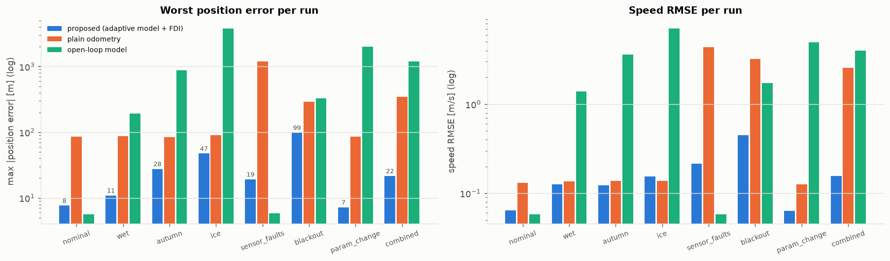
</p>

| | Предложенный навигатор | Обычная одометрия | Модель без обратной связи |
|---|---|---|---|
| Ошибка положения, медиана по 24 случайным прогонам (Монте-Карло) | **0.39 % пути** | 1.57 % | 15.5 % |
| Ошибка положения, худший прогон Монте-Карло | **1.80 %** | 14.2 % | 92.5 % |
| СКО скорости, медиана Монте-Карло | **0.12 м/с** | 0.14 м/с | 3.3 м/с |
| Отказы датчиков + 300 с полной потери одометрии (`sensor_faults`) | **19 м** | 1190 м | 6 м\* |
| Время шага фильтра (чистый Python, 1 ядро) | **0.22 мс** среднее, 0.44 мс p99 | — | — |

\* «Модель без обратной связи» хороша только тогда, когда реальный трамвай совпадает с номинальным
(сухие рельсы, номинальная масса). При смене погоды или параметров её ошибка достигает километров
(см. таблицу результатов).

---

## Содержание

1. [Постановка задачи](#1-постановка-задачи)
2. [Архитектура решения](#2-архитектура-решения)
3. [Математическая модель трамвая](#3-математическая-модель-трамвая)
4. [Адаптивный оцениватель (EKF)](#4-адаптивный-оцениватель-ekf)
5. [Проскальзывание, юз и отказы датчиков (FDI)](#5-проскальзывание-юз-и-отказы-датчиков-fdi)
6. [Бесспутниковая навигация: от расстояния к координатам](#6-бесспутниковая-навигация-от-расстояния-к-координатам)
7. [Пакет ROS 2](#7-пакет-ros-2)
8. [Испытательный стенд (симулятор)](#8-испытательный-стенд-симулятор)
9. [Результаты](#9-результаты)
10. [Быстродействие](#10-быстродействие)
11. [Тесты](#11-тесты)
12. [Структура репозитория](#12-структура-репозитория)
13. [Ограничения и развитие](#13-ограничения-и-развитие)

---

## 1. Постановка задачи

Беспилотный трамвай должен знать своё положение и скорость и тогда, когда пропадает сигнал спутников
(«городские каньоны», тоннели, эстакады) и отказывают другие навигационные системы. В резервном режиме
доступны только внутренние данные:

* **положение ручки контроллера** `u ∈ [-1, 1]` (тяга `u > 0`, выбег, торможение `u < 0`, экстренное
  торможение `u ≤ -0.95`);
* **одометрия**: угловые скорости нескольких колёсных пар (в примере 3 датчика: две моторные оси и одна
  немоторная).

Трудности:

* **проскальзывание и юз** в плохую погоду (мокрые рельсы, листья, лёд). Колесо вращается быстрее
  (тяга) или медленнее (торможение) реальной скорости, иногда буксует на месте;
* **отказы датчиков**: обрыв (нет сообщений), залипание, ноль, выбросы, дрейф масштаба, шум;
* **меняющиеся параметры объекта**: масса с пассажирами, износ бандажей, отказ тягового преобразователя,
  сопротивление движению;
* **стохастичность** возмущений и параметров;
* **жёсткие требования к быстродействию**.

## 2. Архитектура решения

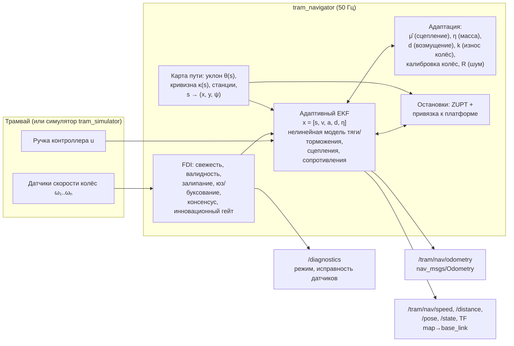

Идея — **«одометр на модели»**. Нелинейная модель предсказывает, как трамвай должен ускоряться при
данном положении ручки, уклоне и сцеплении. Одометрия используется только там, где она физически
правдоподобна и согласована с моделью и другими датчиками. Если одометрии нет совсем, трамвай «ведёт»
сама модель с параметрами, идентифицированными, пока датчики работали.

## 3. Математическая модель трамвая

Параметры по умолчанию соответствуют 100 %-низкопольному трёхсекционному трамваю (класс 71-931М):
номинальная масса 50 т (42 т тара, до 62 т с пассажирами), 4 оси, из них 3 моторные, радиус колеса 0.33 м.

### 3.1 Продольная динамика

$$
(1+\gamma)\,m\,\dot v = F_w(u, v) + F_{tb}(u, v) - F_{res}(v) - m g \sin\theta(s) - m\,k_c\,|\kappa(s)|
$$

| Составляющая | Модель | Нелинейность |
|---|---|---|
| Тяговое усилие | $F_w = \bar u \cdot \min(F_0,\ P/v)$, $F_0 = 70$ кН, $P = 560$ кВт | гиперболическая тяговая характеристика, мёртвая зона ручки |
| Служебное торможение | $F_w = -\bar u_b F_{b,max}\,\mathrm{sgn}(v)$, доля ЭДТ $\sigma(v)$ | смешивание электродинамического и фрикционного тормозов, угасание ЭДТ ниже 1.5 м/с |
| Экстренное торможение | + магниторельсовый тормоз $F_{tb} = -60$ кН | не зависит от сцепления |
| Сопротивление | $F_{res} = m(c_0\,\mathrm{sgn}\,v + c_1 v) + c_2 v\lvert v\rvert$ | сглаженное трение покоя, аэродинамика |
| Уклон и кривые | $g\sin\theta(s)$, $k_c/R(s)$ из карты | зависят от положения |
| Привод | $\dot a = (a_{cmd}(u(t-\tau_d), v) - a)/\tau$, $\tau_d = 0.1$ с | транспортная задержка и инерционность преобразователя |
| Удержание на месте | при $v \approx 0$ и $u \le 0$: $\dot v = 0$ | гибридная модель, трамвай не катится назад под тормозом |

<p align="center">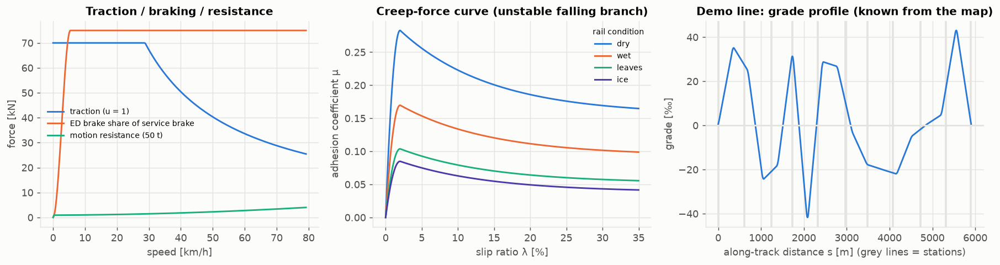</p>

### 3.2 Сцепление колеса с рельсом (кривая крипа)

Сила сцепления оси зависит от относительного проскальзывания $\lambda = (v_w - v)/v$:

$$
\mu(\lambda) = \begin{cases}
\mu_{pk}\,\dfrac{|\lambda|}{\lambda_p}\left(2-\dfrac{|\lambda|}{\lambda_p}\right), & |\lambda| \le \lambda_p \\[2mm]
\mu_{pk}\left(r_s + (1-r_s)\,e^{-\beta(|\lambda|-\lambda_p)}\right), & |\lambda| > \lambda_p
\end{cases}
\qquad \mu_{pk} = \frac{\mu_{max}\,\xi(s)}{1 + c_v |v|}
$$

После пика ($\lambda_p \approx 2\,\%$) ветвь падающая. Как только требуемая сила превышает
$\mu_{pk} N$, движение колеса неустойчиво, и начинается буксование (тяга) или юз (торможение).
$\xi(s)$ — пространственно-коррелированная случайная неоднородность рельса. $\mu_{max}$ задаёт погода:
сухо 0.30, мокро 0.18, листья 0.11, лёд 0.09.

### 3.3 Модель, которую использует навигатор

Навигатор не знает истинных массы, сцепления, износа колёс, КПД тяги и сопротивления. Он использует ту
же структуру модели с **номинальными** параметрами, а расхождение компенсирует адаптивными
состояниями:

$$
\dot v = \underbrace{\mathrm{sat}_{\hat\mu}\!\big(\eta\,a\big)}_{\text{тяга/торможение через колёса}} + \eta\,a_{tb}
- \frac{c_0\,\mathrm{sgn}\,v + c_1 v + \eta\,c_2 v|v|/m_0 + g\sin\theta(s) + k_c|\kappa(s)|}{1+\gamma} + d
$$

* $\eta = m_0/m$ — обратная относительная масса. Идентифицируется онлайн; неопределённость увеличивается
  на каждой остановке, где входят и выходят пассажиры;
* $d$ — немоделируемое удельное усилие (процесс Гаусса–Маркова);
* $\mathrm{sat}_{\hat\mu}$ — **гладкое ограничение по сцеплению**
  $x/(1+|x/L|^6)^{1/6}$, где $L = \hat\mu g\,n_{мот}/n_{осей}/(1+\gamma)$ в тяге (при торможении
  учитывается распределение ЭДТ по моторным осям). Коэффициент $\hat\mu$ оценивается адаптивно
  (раздел 4.3);
* $a$ — состояние привода (запаздывающее заданное удельное усилие).

## 4. Адаптивный оцениватель (EKF)

### 4.1 Вектор состояния и прогноз

$$
x = [\,s,\ v,\ a,\ d,\ \eta\,]^T
$$

Прогноз интегрирует нелинейную модель (Эйлер, 50 Гц) с **аналитическим якобианом**:
$F = I + J\Delta t$, $P \leftarrow FPF^T + Q\Delta t$. Когда обнаружено проскальзывание, модель менее
надёжна, и $Q_v$, $Q_d$ адаптивно увеличиваются.

> **Почему шум привода мал.** В модели есть произведение $\eta\cdot a$. Если разрешить состоянию $a$
> «гулять» (большой $Q_a$), пара $(\eta, a) \to (c\eta,\ a/c)$ становится ненаблюдаемой, и масса
> уплывает даже на идеальных данных. При $Q_a = 0.02$ оценка $\eta$ несмещённая (≈1.00 при номинальной
> массе; при $Q_a = 0.4$ уплывала до ≈0.87 — проверено на прогоне без износа колёс).

### 4.2 Модель измерений (с учётом крипа)

Для каждого исправного канала одометрии:

$$
z_i = \frac{c_i\,\omega_i\,r_0}{k} = \big(1+\lambda_i(x)\big)\Big(v - \dot v\,\frac{T_w}{2}\Big) + n_i,
\qquad
\lambda_i = \lambda_p\left(1-\sqrt{1-\frac{F_{оси,i}}{\hat\mu N_{оси}}}\right)
$$

* $\lambda_i$ — **ожидаемое микропроскальзывание (крип)** оси. Моторные оси под тягой вращаются быстрее
  кузова на доли процента, у предела сцепления до 2 %. Без этой поправки положение систематически
  убегает вперёд;
* $\dot v\,T_w/2$ — групповая задержка счёта импульсов в окне $T_w = 0.1$ с (компенсируется по модельному ускорению);
* $c_i$ — онлайн-калибровка **относительного** радиуса колёс (по консенсусу каналов, среднее
  нормировано);
* $k$ — **общий** масштаб одометрии (средний износ бандажей), наблюдаем только по абсолютным привязкам
  (раздел 6);
* $n_i$ — шум с **адаптивной дисперсией**: Сейдж–Хаса по принятым инновациям плюс оценка шума канала по
  первым разностям. Коррекция устойчива к выбросам (Хьюбер, $k = 2\sigma$).

### 4.3 Адаптация параметров и идентификация

| Величина | Способ |
|---|---|
| $\eta$ (масса, отношение сила/масса) | состояние EKF, случайное блуждание + рост неопределённости на остановках |
| $d$ (возмущение) | состояние EKF, Гаусс–Марков, $\tau = 60$ с |
| $\hat\mu$ (сцепление) | подтверждённое проскальзывание доказывает, что требуемая сила оси превысила сцепление: $\hat\mu \leftarrow \max(0.7\hat\mu,\ \min(\hat\mu,\ 0.9\,F_{оси}/(mg/n)))$. Подтверждение: началось с аномалии ускорения колеса, длится ≥0.3 с, идёт в физически верную сторону, отклонение < 30 %. Сдвиги радиуса, выбросы и «мёртвые» датчики этим условиям не удовлетворяют. Затем медленное восстановление к априорному значению ($\tau = 120$ с) |
| $k$ (износ колёс) | отношение «пройдено по одометру / расстояние по карте» между двумя привязками к станциям. Шаг обновления ограничен ±1 %, при сильном проскальзывании между станциями обновление пропускается |
| $c_i$ (радиусы колёс) | медленная относительная калибровка при малом ускорении, без проскальзывания, при согласованных каналах |
| $R_i$ (шум каналов) | Сейдж–Хаса + модельно-независимая оценка по разностям |
| (опц.) RBF-аппроксиматор $\hat r(v)$ | нормированная RBF-сеть + РНК с забыванием; обучается на $d$. **По умолчанию выключен**, см. абляцию в разделе 9.4 |

<p align="center">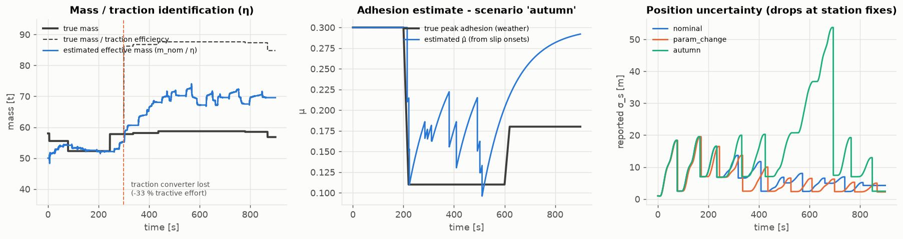</p>

Слева: масса пассажиров меняется на каждой остановке, и оценка её отслеживает. После отказа тягового
преобразователя (t = 300 с) «тяжелее» и «слабее» по разгону неразличимы. Один параметр η обслуживает и
ослабленную тягу, и нетронутое торможение, поэтому «эффективная масса» ложится между истинной массой и
массой/КПД, а остаток забирает возмущение $d$. Скорость при этом оценивается точно (сценарий
`param_change`: 7 м, 0.06 м/с). В центре: $\hat\mu$ падает
при подтверждённом буксовании на листьях. Справа: сообщаемая неопределённость положения сбрасывается
при каждой привязке к станции.

## 5. Проскальзывание, юз и отказы датчиков (FDI)

Каждый канал одометрии в каждом цикле проходит каскад проверок (`tram_nav/core/fdi.py`):

| № | Проверка | Что ловит | Статус |
|---|---|---|---|
| 1 | Свежесть сообщения (тайм-аут 0.3 с) | обрыв линии, отказ датчика | `DROPOUT` |
| 2 | Конечность и физический диапазон | NaN/inf, мусор | `INVALID` |
| 3 | Бит-в-бит одинаковые **сырые** значения ≥1.5 с при движении | залипание, «ноль» | `STUCK` |
| 4 | Ускорение колеса (база 0.2 с) отличается от модельного более чем на $\max(1.5,\ 5\sigma_i\sqrt2/0.2)$ м/с² | буксование/юз, в т.ч. на месте | `SLIP` |
| 5 | Направленная проверка: в тяге канал быстрее эталона, в торможении медленнее. Эталон — самое медленное колесо в тяге (**предпочтительно немоторная ось**, она не может буксовать) и самое быстрое при торможении | буксование и юз | `SLIP` |
| 6 | Консенсус с медианой непроскальзывающих каналов | дрейф масштаба, неисправность | `SUSPECT` → `FAULT` |
| 7 | Нормированная инновация $e^2/S$ против прогноза модели; порог асимметричный, строже в направлении проскальзывания | всё, что не согласуется с физикой | `SUSPECT` |

Ключевые правила принятия решения:

* проскальзывание — **преходящее** состояние (удержание 1 с). Неисправность — **защёлкивающееся**
  (подтверждение 1.5 с, восстановление после 3 с согласованной работы);
* пока какой-то канал буксует, консенсусная проверка приостанавливается для немоторных осей: при
  буксовании двух моторных колёс «в меньшинстве» оказывается как раз исправный немоторный датчик;
* канал, согласный с большинством (≥3 каналов), принимается даже при провале модельного гейта (с
  увеличенной дисперсией). Прогноз мог быть сбит ещё не изолированным отказом;
* **«вечное» буксование — признак отказа эталона.** Реальное буксование ограничено противобуксовочной
  системой несколькими секундами. Если все моторные каналы согласованно «буксуют» относительно
  немоторного дольше 4 с, неисправен сам немоторный датчик (например, дрейф масштаба). Он
  защёлкивается как `FAULT`, а оценка сцепления, построенная на ложных «буксованиях», сбрасывается;
* **повторный захват**: если все каналы отвергнуты дольше 2 с, согласованные между собой и
  непроскальзывающие каналы принимаются в широком гейте. Фильтр не может навсегда «ослепнуть» из-за
  собственного ухода.

Режимы навигатора: `NOMINAL` (все каналы исправны), `DEGRADED` (часть каналов исключена), `BLIND`
(одометрии нет, счисление по модели), `STANDSTILL` (стоянка). Режим, исправность каждого канала,
калибровки, $\hat\mu$, масса, число привязок и время шага публикуются в `/diagnostics`.

## 6. Бесспутниковая навигация: от расстояния к координатам

Трамвай движется по рельсам, поэтому поза — функция одной координаты $s$ (пройденного пути).
Карта пути (`TrackMap`, CSV `s,x,y,z,station`) даёт:

* $s \rightarrow (x, y, \psi)$ для публикации `nav_msgs/Odometry`. Ковариация положения строится
  вдоль/поперёк пути: $\sigma_\parallel = \sigma_s$, $\sigma_\perp = 5$ см;
* уклон $\theta(s)$ и кривизну $\kappa(s)$ для модели (известные возмущения);
* положения платформ.

**Остановки:**

* **ZUPT** (zero-velocity update): все каналы ≈0, тяги нет. Скорость известна (0), положение
  «заморожено», и остановка не приводит к ползучему дрейфу. Вход/выход из режима с гистерезисом;
* **ZUPT по модели при слепом режиме**: тормоз приложен, модель остановилась. Тормоз не может толкать
  трамвай назад, значит он стоит;
* **Привязка остановки к платформе** (опция `nav.station_snap`, по умолчанию включена). Длительная
  остановка рядом с платформой из карты даёт измерение $s = s_{станции}$ с $\sigma = 2.5$ м (×3 после
  проскальзывания: на скользких рельсах трамвай проезжает платформу). Гейт адаптивный (3σ, 20–60 м).
  Если невязка большая, но правдоподобная, дисперсия раздувается (робастно), а не измерение
  отбрасывается. Между двумя привязками оценивается износ колёс $k$.

> Привязка использует только внутренние данные (одометрия и ручка показывают остановку) и карту пути,
> которая нужна в любом случае для выдачи координат. Она не требует ни GNSS, ни инерциальной системы.
> Остановка на светофоре рядом с платформой может дать неверную привязку; гейт и робастная дисперсия
> ограничивают вред. Без привязок (абляция ниже) ошибка ≈1.2 % пути из-за износа колёс.
> С привязками ≈0.1–0.5 % в обычных условиях.

## 7. Пакет ROS 2

### 7.1 Установка и сборка (ROS 2 Humble)

```bash
mkdir -p ~/ros2_ws/src && cd ~/ros2_ws/src
git clone https://github.com/ilushenssss/odometer-on-model.git
cd ~/ros2_ws
source /opt/ros/humble/setup.bash
rosdep install --from-paths src --ignore-src -y     # numpy, nav_msgs, tf2_ros, ...
colcon build --symlink-install --packages-select tram_nav
source install/setup.bash
```

Пакет проверен на ROS 2 Humble: сборка colcon, полный прогон `sim_demo.launch.py` (900 с сценария
`combined` при ×10 реального времени с `/clock`), тест ноды. Использовалась сборка Humble из RoboStack
(conda-forge), т.к. на машине разработки Ubuntu 24.04. Ядро алгоритма (`tram_nav/core`) — чистый
Python + NumPy, от ROS не зависит.

### 7.2 Запуск

```bash
# Полная демонстрация: симулятор + навигатор + оценка точности
ros2 launch tram_nav sim_demo.launch.py scenario:=autumn real_time_factor:=5.0 log_csv:=/tmp/run.csv

# Только навигатор - на реальном трамвае или с rosbag
ros2 launch tram_nav navigator.launch.py track_csv:=/path/to/line.csv

# Смотрим результат
ros2 topic echo /tram/nav/speed
ros2 topic echo /tram/nav/odometry
ros2 topic echo /diagnostics
```

Сценарии: `nominal`, `wet`, `autumn`, `ice`, `sensor_faults`, `blackout`, `param_change`, `combined`.
При `real_time_factor ≠ 1` симулятор публикует `/clock`, и все ноды работают в симулированном времени.

### 7.3 Ноды и топики

**`tram_navigator`** (`ros2 run tram_nav navigator`) — основная нода.

| Направление | Топик | Тип | Содержание |
|---|---|---|---|
| вход | `/tram/controller_handle` | `std_msgs/Float64` | положение ручки `u ∈ [-1, 1]` |
| вход | `/tram/wheel_speeds` | `sensor_msgs/JointState` | `velocity[]` — угловые скорости колёс, рад/с; `NaN` = нет данных; `name[]` сопоставляется с `wheel_joint_names` |
| вход | `/tram/nav/set_position` | `std_msgs/Float64` | ручная переинициализация $s$ |
| выход, 50 Гц | `/tram/nav/odometry` | `nav_msgs/Odometry` | поза на карте, скорость, ковариации |
| выход, 50 Гц | `/tram/nav/pose` | `geometry_msgs/PoseWithCovarianceStamped` | поза |
| выход, 50 Гц | `/tram/nav/speed`, `/tram/nav/distance` | `std_msgs/Float64` | скорость [м/с], пройденный путь [м] |
| выход, 50 Гц | `/tram/nav/state` | `std_msgs/Float64MultiArray` | `s, v, a, σs, σv, η, масса, d, μ̂, rbf, k, режим, t_blind, n_used, n_fixes, x, y, ψ` (подписи в `layout`) |
| выход, 1 Гц | `/diagnostics` | `diagnostic_msgs/DiagnosticArray` | режим, статус каждого датчика, калибровки, время шага, перерасходы бюджета |
| выход | TF `map → base_link` | | |

**`tram_simulator`** публикует `controller_handle`, `wheel_speeds`, `ground_truth`
(`nav_msgs/Odometry`, в `pose.position.z` — истинный $s$), `weather`, `/clock`.
**`tram_nav_evaluator`** сравнивает оценку с истиной, публикует `/tram/eval/errors` и пишет CSV.

### 7.4 Параметры

`tram_nav/config/navigator.yaml`: любое поле `TramParams` / `NavigatorParams`
(`tram_nav/core/params.py`) переопределяется с префиксом `tram.` / `nav.`. Основные:

| Параметр | По умолчанию | Смысл |
|---|---|---|
| `rate` | 50 | частота фильтра и публикации, Гц |
| `wheel_joint_names` | `[axle_0, axle_2, axle_3]` | каналы одометрии |
| `sensor_powered` | `[true, true, false]` | моторная ли ось у канала (важно для логики буксования) |
| `tram.mass_nominal`, `tram.wheel_radius`, `tram.traction_*`, `tram.brake_*` | см. `params.py` | паспортные данные трамвая |
| `nav.station_snap` | `true` | привязка остановок к платформам |
| `nav.rbf_enable` | `false` | RBF-аппроксиматор остатка |
| `nav.q_*`, `nav.r_wheel`, `nav.gate_chi2`, `nav.slip_*` | см. `params.py` | настройка фильтра и FDI |

## 8. Испытательный стенд (симулятор)

Реальных записей с трамвая нет, поэтому создан **высокоточный симулятор** (`core/simulator.py`). Он
намеренно сложнее модели навигатора: навигатор не «подглядывает» в симулятор.

* динамика **каждой колёсной пары** с кривой крипа. Гибридная модель «крип / макропроскальзывание»
  воспроизводит буксование, юз и буксование на месте на подъёме;
* бортовая **противобуксовочная/противоюзная система** (модулирует момент, даёт пилообразные колебания
  скорости колёс);
* пространственно-коррелированная случайная неоднородность сцепления, смена погоды во времени;
* запаздывание и инерционность привода, смешивание ЭДТ/фрикционного тормоза, магниторельсовый тормоз;
* неизвестная и меняющаяся масса (пассажиры на каждой остановке), износ каждого колеса, потеря
  тягового преобразователя, +15 % к сопротивлению;
* **инкрементальные энкодеры** 200 имп/об с квантованием счёта в окне 0.1 с и шумом;
* инжекция отказов: `dropout`, `stuck`, `zero`, `spikes`, `scale`, `noise`;
* модель водителя: ограничения скорости в кривых, остановки на каждой станции, экстренные торможения.

<p align="center">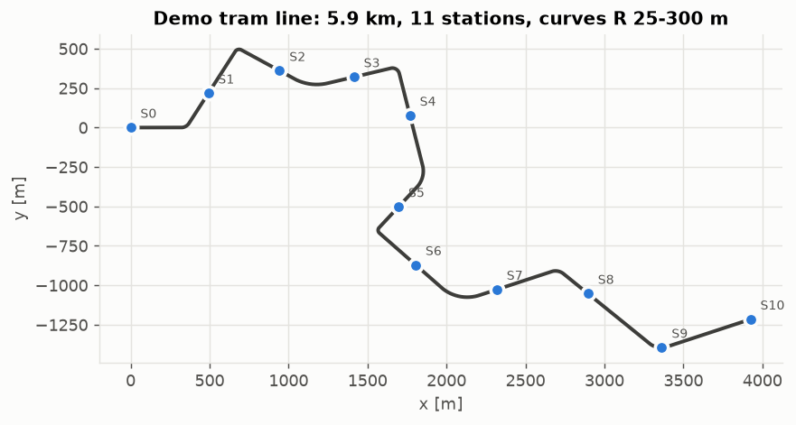</p>

Демонстрационная линия: 5.9 км, 11 остановок, кривые R = 25–300 м, уклоны до ±45 ‰.

## 9. Результаты

Все графики и таблицы воспроизводятся одной командой:

```bash
pip install -r requirements.txt
python3 scripts/generate_figures.py     # ~6 мин на 4 ядрах, пишет docs/images/*.png и docs/results.md
```

Для сравнения на тех же данных работают два базовых метода:

* **обычная одометрия**: среднее всех датчиков с номинальным радиусом, интегрирование, без обработки
  отказов;
* **модель без обратной связи**: та же номинальная модель по ручке, без датчиков.

### 9.1 Сводная таблица (один прогон каждого сценария, 900–1100 с, 5.9 км)

| Сценарий | Макс. ошибка положения, м: **предложенный** / одометрия / модель | % пути | СКО скорости, м/с: **предложенный** / одометрия / модель | Внутри ±3σ |
|---|---|---|---|---|
| `nominal` — сухо | **7.6** / 86.2 / 5.6 | 0.13 | **0.064** / 0.132 / 0.058 | 100 % |
| `wet` — мокрые рельсы | **10.9** / 87.4 / 193.2 | 0.18 | **0.126** / 0.136 / 1.393 | 100 % |
| `autumn` — листья | **27.7** / 84.2 / 869.9 | 0.47 | **0.123** / 0.137 / 3.584 | 96 % |
| `ice` — лёд | **47.3** / 90.2 / 3811.7 | 0.80 | 0.154 / **0.137** / 7.103 | 81 % |
| `sensor_faults` — отказы + 300 с без одометрии | **19.2** / 1189.5 / 5.8 | 0.33 | **0.214** / 4.383 / 0.058 | 100 % |
| `blackout` — мокро, тяжёлый вагон, 300 с без одометрии | **98.7** / 292.3 / 325.4 | 1.67 | **0.446** / 3.211 / 1.719 | 100 % |
| `param_change` — пассажиры, −33 % тяги, +15 % сопротивления | **7.2** / 85.5 / 1989.7 | 0.12 | **0.064** / 0.126 / 4.963 | 100 % |
| `combined` — всё сразу | **21.6** / 345.6 / 1196.6 | 0.37 | **0.157** / 2.549 / 4.013 | 98 % |

«Внутри ±3σ» — доля времени, когда истинная ошибка укладывается в сообщаемую навигатором
неопределённость. Это важно для безопасности: навигатор знает, насколько он неточен.

### 9.2 Сценарии подробно

На каждом рисунке сверху вниз: скорость, ошибка скорости, ошибка положения с полосой ±3σ, статус
каждого датчика во времени. Штриховка — режим BLIND (нет пригодной одометрии).

**Отказы датчиков и 300 с полной потери одометрии.** Залипание (100–160 с), ноль (200–260 с), выбросы
(300–400 с), дрейф масштаба ×0.9 (450–550 с) изолированы. Обычная одометрия уходит на километр. В
слепом режиме навигатор ведёт трамвай по модели, останавливает его по модели и привязывает остановки к
платформам.

<p align="center">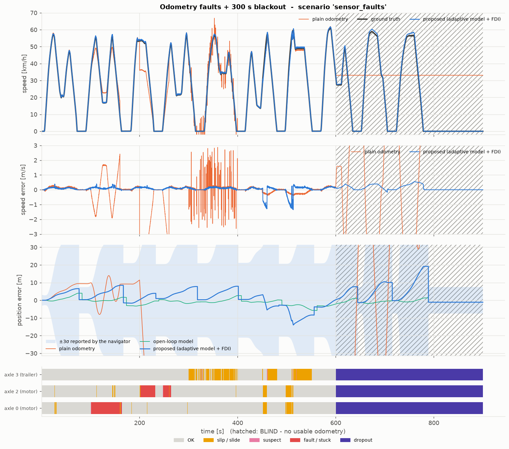</p>

**Листья на рельсах: буксование и юз.** Моторные оси буксуют (жёлтое на полосе статусов), а
немоторная ось остаётся эталоном.

<p align="center">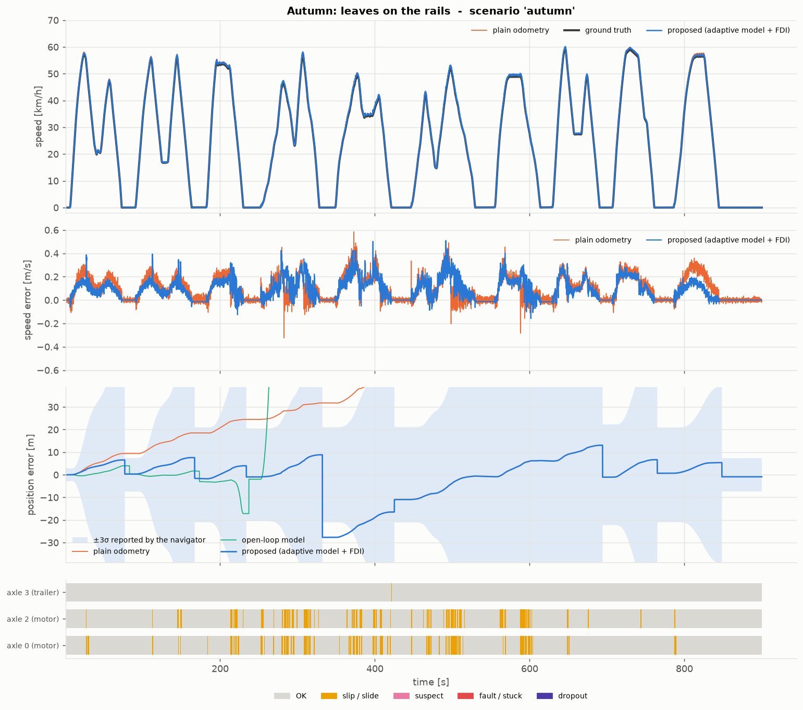</p>

**Меняющийся объект.** Масса меняется на каждой остановке, на 300 с теряется треть тяги, сопротивление
на 15 % выше паспортного.

<p align="center">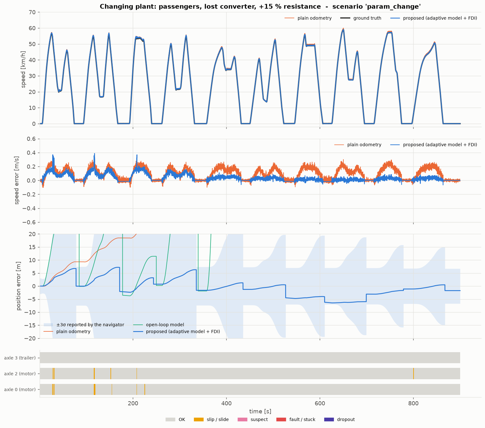</p>

**Всё сразу**: мокро → листья → мокро, шумный датчик, залипание, выбросы, два экстренных торможения,
120 с без одометрии.

<p align="center">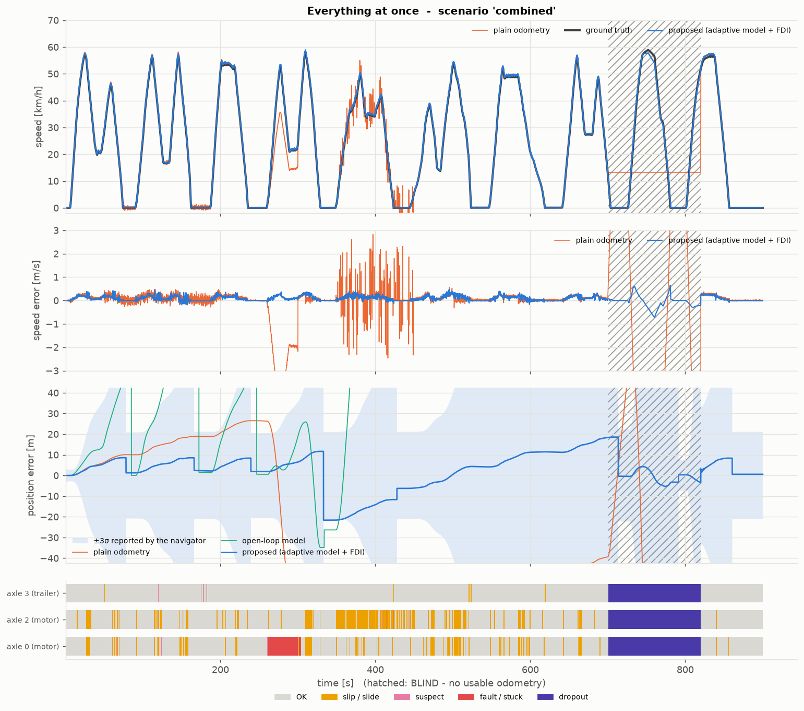</p>

<details>
<summary>Остальные сценарии: nominal, wet, ice, blackout</summary>

<p align="center">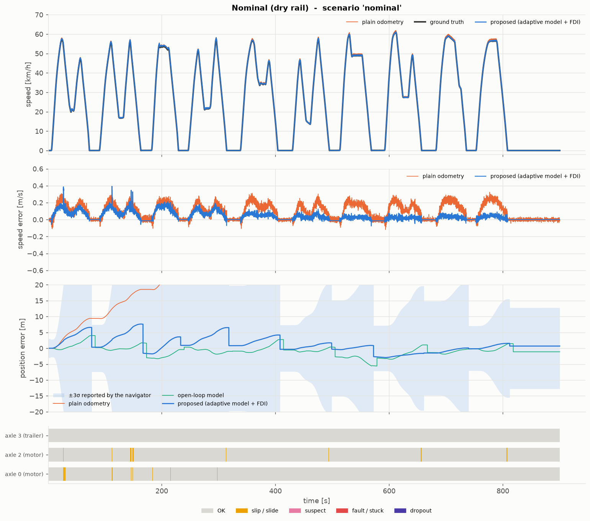</p>
<p align="center">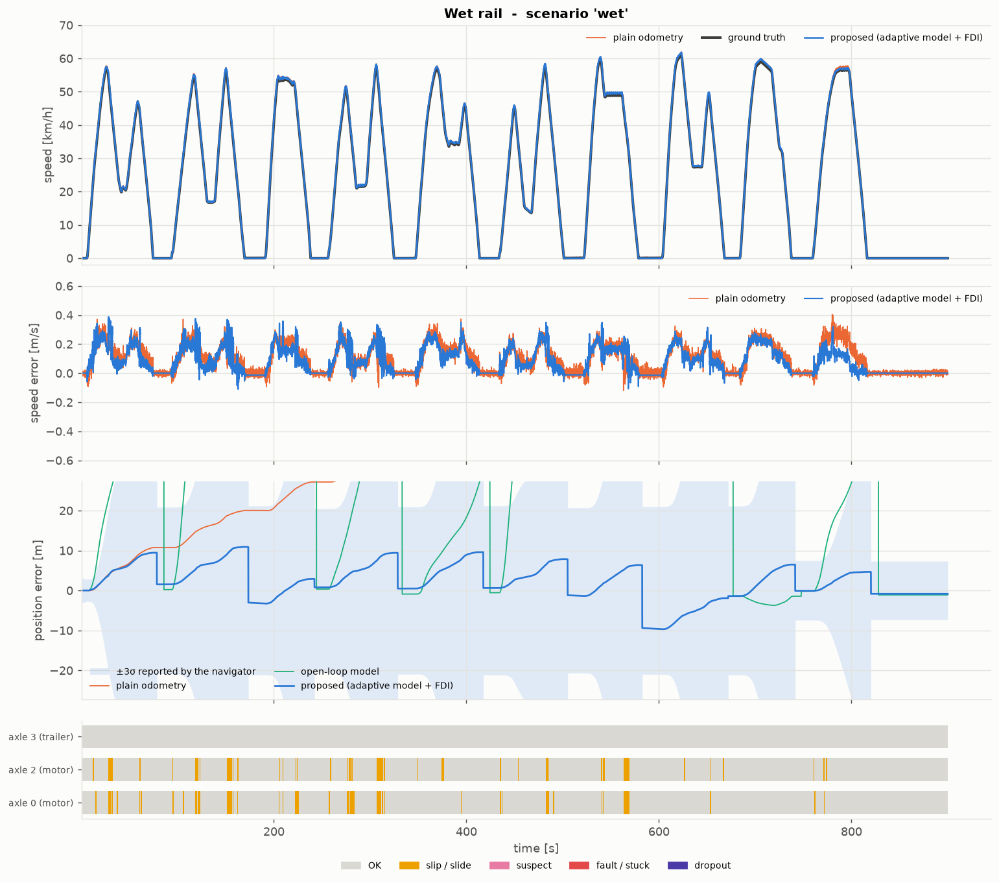</p>
<p align="center">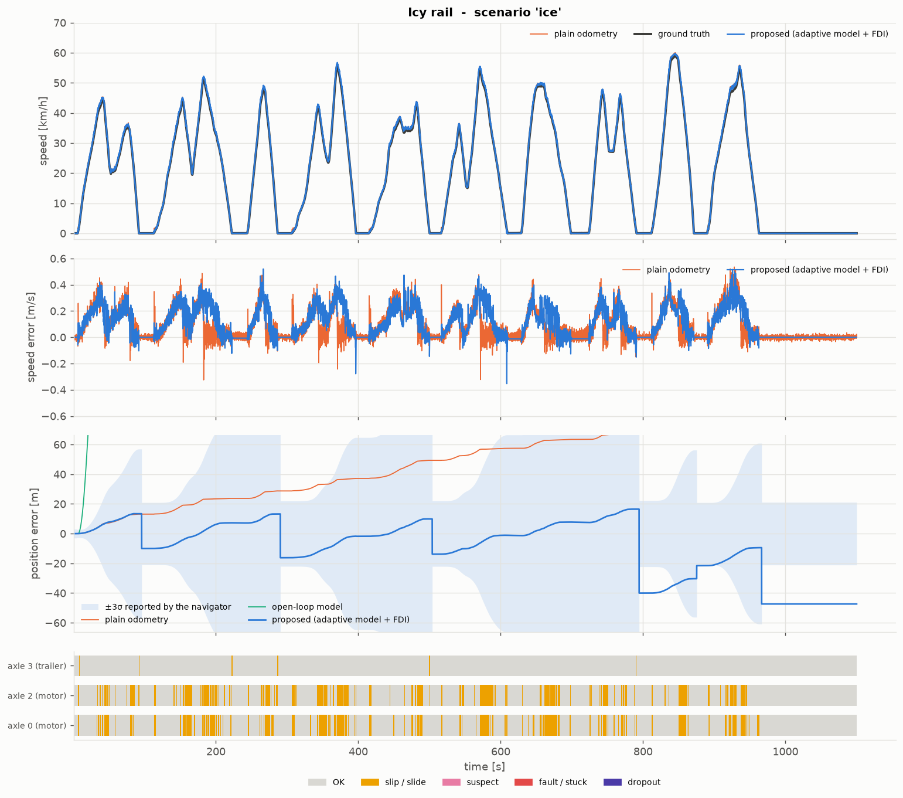</p>
<p align="center">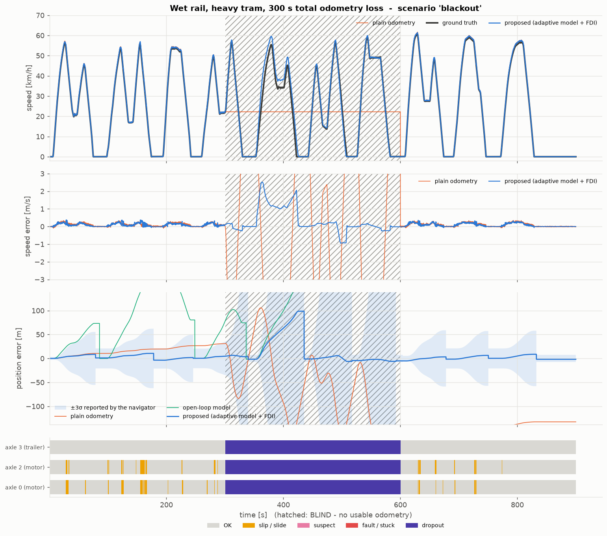</p>
</details>

### 9.3 Монте-Карло

24 прогона: случайный сценарий, зерно, износ колёс, поле сцепления, пассажиропоток.

<p align="center">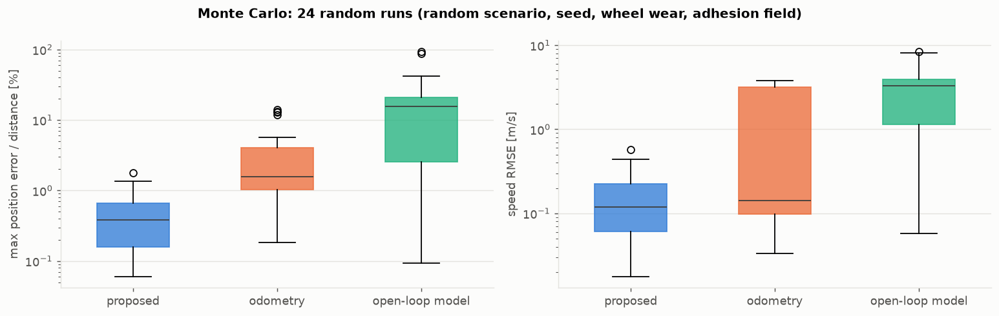</p>

| | медиана | p90 | максимум |
|---|---|---|---|
| Ошибка положения / пройденный путь — **предложенный** | **0.39 %** | **1.07 %** | **1.80 %** |
| — обычная одометрия | 1.57 % | 12.5 % | 14.2 % |
| — модель без обратной связи | 15.5 % | 40.2 % | 92.5 % |
| СКО скорости — **предложенный** | **0.12 м/с** | | **0.57 м/с** |

Полная таблица прогонов — в [`docs/results.md`](docs/results.md).

### 9.4 Абляция: что даёт каждый компонент

| Прогон (seed 1) | Макс. ошибка положения, м | СКО скорости, м/с |
|---|---|---|
| `nominal`, всё включено | 7.6 | 0.064 |
| `nominal` **без привязки к платформам** | 72.8 | 0.111 |
| `autumn`, всё включено | 27.7 | 0.123 |
| `autumn` **без привязки к платформам** | 80.5 | 0.127 |

Без привязки остаётся ошибка общего масштаба из-за износа колёс (≈1.2 % пути): её нельзя наблюдать ни
по одометрии, ни по модели.

**Честно об RBF-аппроксиматоре.** В ядре реализован онлайн-аппроксиматор остатка модели (нормированная
RBF-сеть + рекурсивный МНК с забыванием, `core/rbf.py`, покрыт тестами). Сравнение по 4 зёрнам
(средняя максимальная ошибка положения, м):

| Сценарий | без RBF (по умолчанию) | с RBF |
|---|---|---|
| `blackout` | 53.9 | 47.7 |
| `combined` | 38.0 | 36.3 |
| `param_change` | 9.2 | 9.2 |
| `sensor_faults` | **22.0** | 63.4 |

Выигрыш небольшой и неустойчивый, а в сценарии с отказами датчиков RBF заметно вредит: он запоминает
остаток, искажённый ещё не изолированным отказом, и потом переносит его в счисление без датчиков.
Остаток, который он мог бы выучить, в основном уже забирают физически осмысленные адаптивные состояния
$\eta$, $d$, $\hat\mu$, $k$. В двумерном варианте $\hat r(v, u)$ он вдобавок конкурировал с $\eta$ за один
и тот же сигнал (неидентифицируемость). Поэтому он выключен по умолчанию (`nav.rbf_enable: false`) и
оставлен как опция. В нашей постановке роль «адаптивного нелинейного аппроксиматора» выполняет
нелинейная физическая модель, параметры которой идентифицируются онлайн.

Рисунок ниже наглядно показывает проблему. В сценарии `param_change` истинная ошибка сопротивления
(+15 %) составляет всего ~0.005 м/с² (чёрная линия). RBF выучивает остаток в 10–30 раз больше: он
поглощает и потерю тяги, и ошибку массы, то есть конкурирует с $\eta$ за один и тот же сигнал.

<p align="center">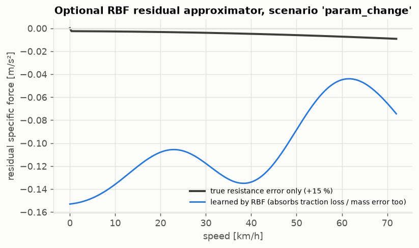</p>

## 10. Быстродействие

<p align="center">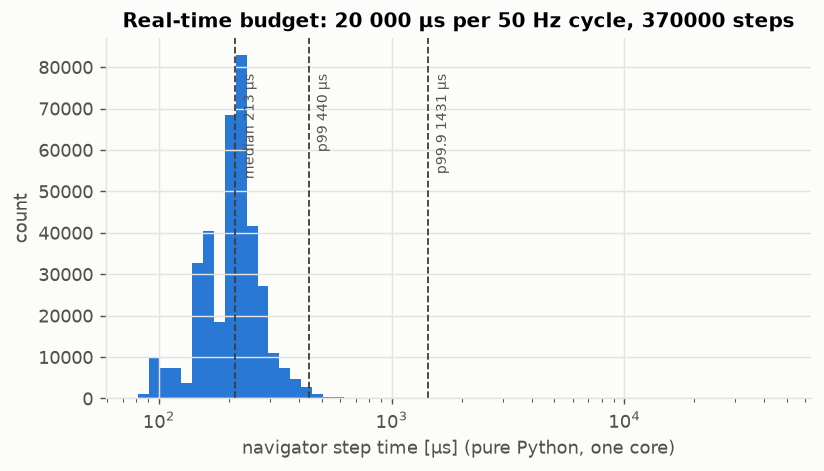</p>

* **Шаг фильтра: 0.22 мс в среднем, 0.44 мс p99** на одном ядре, чистый Python + NumPy (370 000
  шагов). Бюджет при 50 Гц — 20 мс, то есть используется ~1 %.
* Единичные выбросы (в этом прогоне максимум 46 мс за 370 000 шагов, т.е. один раз больше бюджета) —
  это сборка мусора Python и планировщик ОС на общей машине, а не алгоритм. В ROS-ноде они считаются
  как перерасход бюджета (`budget_overruns` в `/diagnostics`). Для систем с гарантированным временем отклика
  алгоритм без изменений переносится на C++ (фиксированный размер 5×5, без динамической памяти).
* Все операции O(1) по времени и памяти: 5 состояний, скалярные последовательные обновления, поиск по
  карте — бинарный.

## 11. Тесты

```bash
cd tram_nav
python3 -m pytest -q test                # 31 тест ядра (~40 с)
# в окружении ROS 2 Humble дополнительно выполняется тест ноды:
source /opt/ros/humble/setup.bash && python3 -m pytest -q test/test_ros_nodes.py
colcon test --packages-select tram_nav   # из рабочего пространства
```

| Файл | Что проверяется |
|---|---|
| `test_physics.py` | ручка, тяговая характеристика (непрерывность), тормоза, ЭДТ, кривая крипа (пик, обратная функция), гладкое насыщение и его производная |
| `test_track.py` | поза и экстраполяция, кривизна окружности, CSV туда-обратно, станции |
| `test_rbf.py` | разбиение единицы, обучение гладкой функции, ограничение весов и ковариации |
| `test_fdi.py` | исправные каналы, обрыв/NaN, залипание, нулевой датчик, буксование в тяге, повторный захват |
| `test_estimator.py` | нет дрейфа на стоянке, слежение за скоростью, слепой режим, замкнутый контур (номинал, листья, отказы) лучше одометрии, идентификация массы, бюджет времени |
| `test_ros_nodes.py` | нода навигатора в ROS 2: публикует одометрию, обрабатывает `NaN` как обрыв канала |

## 12. Структура репозитория

```
├── README.md
├── requirements.txt              # numpy, matplotlib, pytest (для ядра, тестов и графиков)
├── scripts/generate_figures.py   # все эксперименты, графики и таблицы
├── docs/
│   ├── images/                   # рисунки README
│   ├── results.md / results.json # полные численные результаты
└── tram_nav/                     # пакет ROS 2 (ament_python)
    ├── package.xml, setup.py, setup.cfg
    ├── config/  navigator.yaml, simulator.yaml, demo_track.csv
    ├── launch/  navigator.launch.py, sim_demo.launch.py
    ├── test/    ...
    └── tram_nav/
        ├── core/                 # алгоритм, без зависимости от ROS
        │   ├── params.py         # параметры трамвая, датчиков, навигатора, сценариев
        │   ├── physics.py        # нелинейная физика: тяга, тормоза, сопротивление, сцепление
        │   ├── estimator.py      # адаптивный EKF-навигатор
        │   ├── fdi.py            # обнаружение буксования/юза и отказов датчиков
        │   ├── rbf.py            # RBF-аппроксиматор остатка (опционально)
        │   ├── track.py          # карта пути
        │   ├── simulator.py      # симулятор-стенд
        │   ├── driver.py         # модель водителя
        │   ├── scenarios.py      # сценарии испытаний
        │   └── evaluation.py     # замкнутый прогон и метрики
        └── nodes/                # ноды ROS 2: navigator, simulator, evaluator
```

## 13. Ограничения и развитие

* **Проверено на симуляторе, не на реальном трамвае.** Симулятор намеренно богаче модели навигатора,
  но перед эксплуатацией параметры (тяговая характеристика, кривая крипа, шумы) нужно уточнить по
  записям реальных поездок. Структура `TramParams`/`NavigatorParams` позволяет это сделать без правки
  кода.
* **Лёд и длительная полная потеря одометрии** — самые тяжёлые случаи: 0.8–1.8 % пути. На льду
  СКО скорости на уровне одометрии, выигрыш только в положении. Сообщаемая
  неопределённость при этом честно растёт, и пользователь знает, что точность снижена.
* Немоторная ось — эталон при тяге. Если отказывает именно она (например, дрейф масштаба), до
  срабатывания консенсусной проверки (~1.5 с) возможны кратковременные ошибки скорости (видно на
  графике `sensor_faults` около 450–550 с).
* Привязка к платформам предполагает, что длительные остановки происходят у платформ. Для линий с
  частыми остановками у светофоров вблизи платформ её гейт стоит ужесточить.
* Развитие: перенос ядра на C++ для жёсткого реального времени; сигнал открытия дверей как
  подтверждение остановки у платформы; сопоставление профиля кривизны с картой (map-matching) по
  разности скоростей колёс левого и правого бортов, если такие датчики доступны; обучение параметров
  кривой крипа по накопленным данным.

---

Лицензия: MIT.
