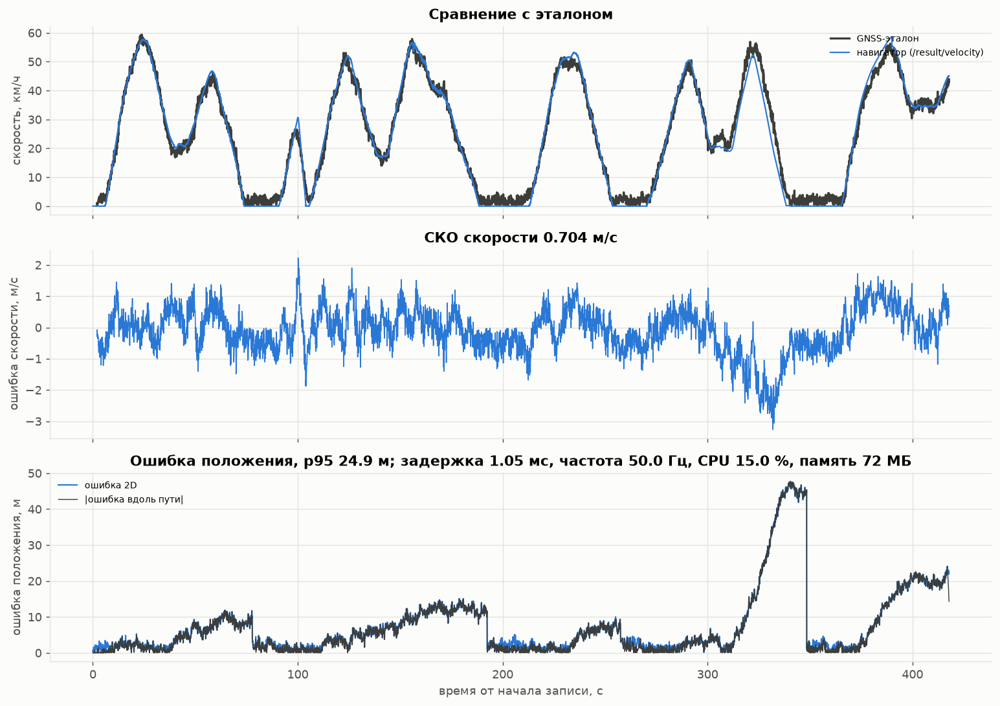
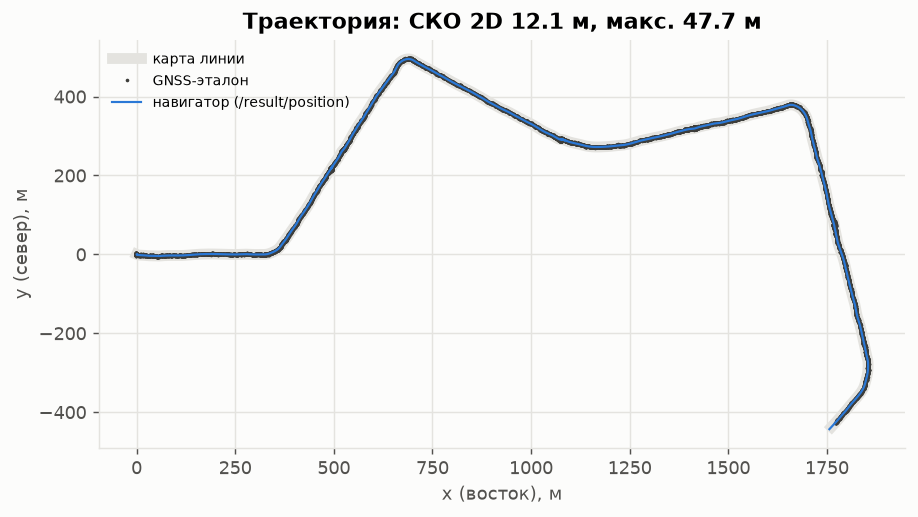
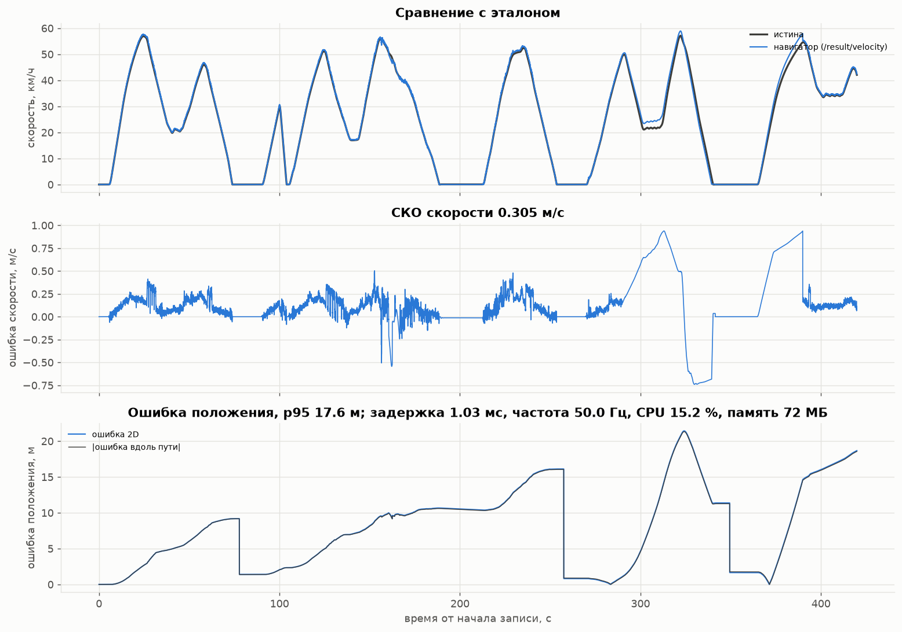
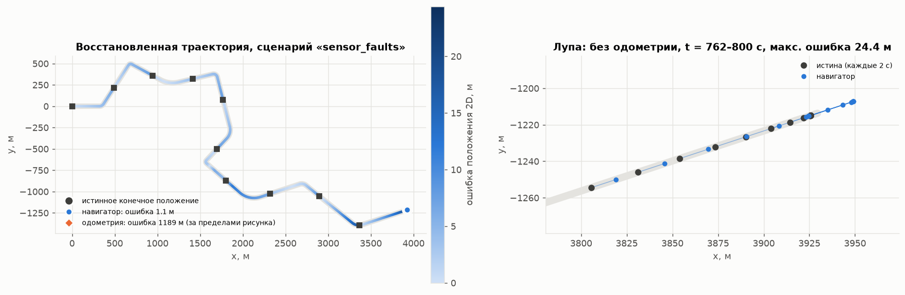

# Точность и быстродействие

Все числа воспроизводимы:

* офлайн-эксперименты (сценарии, траектория, Монте-Карло, время шага) —
  `python3 scripts/generate_figures.py` → [`docs/results.md`](results.md), `docs/images/*`;
* прогон через ROS 2 с rosbag (сравнение с GNSS, задержка, частота, CPU, память) —
  `ros2 launch tram_nav bag_replay.launch.py ...` ([JURY_GUIDE.md](JURY_GUIDE.md)) →
  [`docs/bag_eval_gnss_summary.json`](bag_eval_gnss_summary.json),
  [`docs/bag_eval_truth_summary.json`](bag_eval_truth_summary.json);
* тесты траектории — `python3 scripts/run_trajectory_tests.py` → [`docs/trajectory_tests.md`](trajectory_tests.md).

## 1. Методика сравнения с GNSS-эталоном

**Эталоны.** Используются два:

1. **GNSS** (`sensor_msgs/NavSatFix`, 10 Гц) — так оценка будет проводиться на реальных данных. В
   демо-bag GNSS имитирован по истине симулятора: белый шум 0,75 м по каждой оси плюс медленный
   дрейф (многолучёвость, итого ≈ 1,5 м), высота — с шумом 3 м;
2. **истина симулятора** (`nav_msgs/Odometry`) — точная. Позволяет отделить ошибки навигатора от
   ошибок самого GNSS.

**Процедура** (нода `tram_nav_evaluator`, [`evaluator_node.py`](../tram_nav/tram_nav/nodes/evaluator_node.py)):

1. GNSS → локальная система карты (восток/север, начало — первая точка карты с lat/lon или
   `geo_origin`; касательная плоскость WGS-84, ошибка < 1 см/км).
2. Для каждой оценки `/result/position` с меткой $t$ эталон интерполируется линейно на $t$ (без
   экстраполяции; разрывы эталона > 1 с не интерполируются). В режиме `event` метка оценки равна
   метке входного измерения, поэтому задержка обработки не входит в ошибку положения.
3. **Ошибка 2D** $e_{2D} = \lVert p_{est} - p_{ref}\rVert$; **ошибка вдоль пути** — разность проекций на
   линию $s(p_{est}) - s(p_{ref})$.
4. **Эталонная скорость** — центральная разность GNSS-координат на ±2 с (для истины — её скорость).
   Важно: шум GNSS смещает такую скорость вверх на малых скоростях (на стоянке ≈ 0,5–1 м/с), поэтому
   СКО скорости «против GNSS» — верхняя оценка; истинная точность — в столбце «против истины».
5. Метрики: СКО, p95, максимум и конечная ошибка 2D; СКО и p95 |ошибки скорости|; число
   сопоставленных отсчётов, пройденный путь.

**Базовые методы** (офлайн, на тех же данных): обычная одометрия (среднее датчиков × номинальный
радиус, без обработки отказов) и модель без обратной связи (та же номинальная модель по ручке).

## 2. Прогон rosbag через ROS 2 (реальное время)

Демо-bag [`data/demo_bag`](../data/demo_bag): 420 с, 2,9 км, мокро → листья → мокро, залипание
датчика, выбросы, экстренное торможение, смена пассажиров, **100 с полной потери одометрии**.
Навигатор в режиме `event`, `ros2 bag play --clock` со скоростью 1,0.

| эталон | карта | СКО 2D, м | p95 2D, м | макс. 2D, м | СКО скорости, м/с | p95 \|e_v\|, м/с | отсчётов |
|---|---|---|---|---|---|---|---|
| истина | точная | **9.7** | 17.6 | 21.4 | **0.31** | 0.75 | 20 995 |
| **GNSS** | построена по GNSS этого же bag | **12.1** | 24.9 | 47.7 | 0.70\* | 1.36\* | 20 892 |

\* включает шум эталонной скорости по GNSS (см. п. 1.4).

Для сравнения, на тех же данных: обычная одометрия — максимум 727 м (сбой датчиков и 100 с без
данных), модель без обратной связи — 156 м.

С картой из GNSS результат хуже (максимум 48 м против 21 м). Карта строилась по этому же рейсу: план
линии восстановлен хорошо (боковое отклонение в среднем 1,0 м, максимум 3,9 м; уклоны ±7 ‰), но
автоматический поиск платформ по стоянкам ≥ 10 с принял за платформу остановку после экстренного
торможения (1389 м) и пропустил настоящую платформу на 1240 м. Поэтому одна привязка была ложной
(скачок ошибки до 48 м на 330–350 с на графике ниже). Для эксплуатации карту нужно строить по
штатному рейсу в хорошую погоду, а платформы проверять или отмечать вручную (столбец `station` в CSV).

То же против истины

## 3. Задержка, частота, ресурсы

Измерено в прогоне из раздела 2 (ROS 2 Humble, rclpy, один процесс навигатора; сборка RoboStack на
Ubuntu 24.04, облачная ВМ с 4 vCPU; одновременно работали оценщик и `ros2 bag play`).

| метрика | значение | как измерено |
|---|---|---|
| время шага фильтра | **0,29–0,32 мс** среднее, 1,7–2,8 мс максимум | `time.perf_counter` вокруг `step()` (`/result/perf`, `/diagnostics`) |
| задержка вход → выход | **0,92–0,96 мс** среднее (по оценщику 1,03–1,05 мс); максимум средних за 1 с — 1,5–1,7 мс; абсолютный максимум 3,4–4,9 мс | от приёма `JointState` нодой до публикации `/result/*`, учитывающей его |
| частота выхода | **50,0 Гц** (= частоте одометрии) | интервалы публикации |
| выходов за прогон | 21 001 из 21 001 входных сообщений одометрии | счётчик ноды |
| превышения бюджета 5 мс | 0–1 за 420 с (21 001 шаг) | `budget_overruns` |
| CPU | **13–15 %** одного ядра (максимум 20 %) | `os.times()` процесса за 1 с |
| память (RSS) | **72 МБ** | `/proc/self/status` |

Большая часть CPU — накладные расходы rclpy на приём и публикацию ~10 топиков по 50 Гц; сам фильтр
занимает ≈ 1,5 % ядра (0,3 мс × 50 Гц).

**Офлайн (чистое ядро, без ROS), 412 000 шагов:** среднее **0,15 мс**, медиана 0,14 мс, p99 0,38 мс,
максимум 31 мс (единичная пауза сборщика мусора Python). Бюджет цикла 50 Гц — 20 мс.

## 4. Офлайн-сценарии (эталон — истина, 5,9 км)

| сценарий | макс. ошибка положения, м: навигатор / одометрия / модель | % пути | СКО скорости, м/с: навигатор / одометрия / модель | внутри ±3σ |
|---|---|---|---|---|
| `nominal` — сухо | **7.6** / 86.2 / 5.6 | 0.13 | **0.064** / 0.132 / 0.058 | 100 % |
| `wet` — мокро | **10.9** / 87.4 / 193.2 | 0.18 | **0.125** / 0.136 / 1.393 | 100 % |
| `autumn` — листья | **27.7** / 84.2 / 869.9 | 0.47 | **0.122** / 0.137 / 3.584 | 96 % |
| `ice` — лёд | **47.4** / 90.2 / 3395.6 | 0.80 | 0.151 / **0.137** / 6.499 | 82 % |
| `sensor_faults` — отказы + 300 с без одометрии | **24.4** / 1189.5 / 5.8 | 0.41 | **0.232** / 4.383 / 0.058 | 100 % |
| `blackout` — мокро, 300 с без одометрии | **104.8** / 292.3 / 325.4 | 1.78 | **0.470** / 3.211 / 1.719 | 100 % |
| `param_change` — масса, −33 % тяги, +15 % сопротивления | **7.2** / 85.5 / 1839.8 | 0.12 | **0.064** / 0.126 / 4.597 | 100 % |
| `combined` — всё сразу | **21.6** / 345.6 / 1044.9 | 0.37 | **0.157** / 2.549 / 3.850 | 98 % |
| `demo` — сценарий демо-bag (2,9 км) | **24.1** / 727.2 / 156.3 | 0.83 | **0.302** / 4.292 / 2.338 | 100 % |
| `leaves_blackout` — трудный случай (2,9 км) | 427.6 / 509.9 / 440.8 | 15.0 | 3.414 / 3.931 / 3.915 | 92 % |

**Траектория на плоскости** (все точки на рельсах, отклонение 0,000 м):

| сценарий | СКО 2D, м | p95, м | макс., м | курс p95, ° |
|---|---|---|---|---|
| `nominal` | 2.6 | 6.2 | 7.6 | 1.2 |
| `wet` | 5.0 | 9.5 | 10.9 | 3.5 |
| `autumn` | 8.9 | 22.7 | 27.7 | 4.9 |
| `ice` | 21.2 | 47.4 | 47.4 | 10.2 |
| `sensor_faults` | 6.5 | 15.7 | 24.4 | 5.5 |
| `blackout` | 20.8 | 55.8 | 104.8 | 5.0 |
| `param_change` | 3.4 | 6.4 | 7.2 | 1.4 |
| `combined` | 9.0 | 19.0 | 21.6 | 5.9 |

**Монте-Карло** (24 случайных прогона: сценарий, зерно, износ колёс, поле сцепления):

| | медиана | p90 | максимум |
|---|---|---|---|
| ошибка положения / путь — **навигатор** | **0.38 %** | **1.01 %** | **1.72 %** |
| — обычная одометрия | 1.57 % | 12.5 % | 14.2 % |
| — модель без обратной связи | 15.5 % | 35.1 % | 79.9 % |
| СКО скорости — навигатор | 0.12 м/с | | 0.54 м/с |

Графики: [`summary.png`](images/summary.png), [`montecarlo.png`](images/montecarlo.png), сценарии
`images/scenario_*.png`, траектория `images/trajectory_*.png` (см. README, разделы 9–10).

